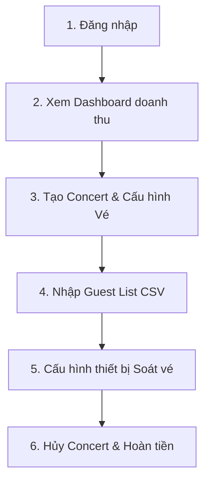

# KỊCH BẢN DEMO GIAO DIỆN QUẢN TRỊ (ADMIN-WEB)
**Dự án:** TicketBox - Hệ thống quản lý và phân phối vé sự kiện
**Đối tượng demo:** Giao diện Ban tổ chức (Organizer) và Admin
**Tính năng bao phủ:** Đăng nhập, Dashboard thống kê, CRUD Concert, Cấu hình loại vé, Nhập Guest List CSV (Staging & Validation), Quản lý thiết bị quét (Scanner), Quy trình Hủy Concert & Hoàn tiền (Refund) - *Không bao gồm AI Artist Bio*.

---

## 🛠️ PHẦN 1: CHUẨN BỊ MÔI TRƯỜNG

Trước khi tiến hành demo, đảm bảo các dịch vụ sau đã được khởi chạy thành công:

### 1. Khởi động PostgreSQL & Redis
Mở Terminal tại thư mục `src/backend-api` và chạy lệnh:
```bash
docker-compose up -d
```
> [!NOTE]
> Database PostgreSQL sẽ chạy ở cổng `5433` và Redis ở cổng `6379`.

### 2. Khởi chạy Backend API
Cũng tại thư mục `src/backend-api`, thực hiện chạy seed dữ liệu mẫu và khởi động server:
```bash
npm run db:prepare
npm run db:seed
npm run start:dev
```
> [!IMPORTANT]
> API Server sẽ lắng nghe tại `http://localhost:3000`.

### 3. Khởi chạy Admin Web
Mở Terminal tại thư mục `src/admin-web`, cài đặt dependencies và chạy dự án Next.js:
```bash
npm install
npm run dev
```
> [!IMPORTANT]
> Trang quản trị Admin Web chạy tại `http://localhost:3001`.

### 4. Thông tin tài khoản Demo
* **Email:** `organizer@ticketbox.local`
* **Mật khẩu:** `Password123!`

---

## 🎬 KỊCH BẢN DEMO CHI TIẾT (STEP-BY-STEP)



### 🚪 BƯỚC 1: ĐĂNG NHẬP & TỔNG QUAN DASHBOARD

**Mục tiêu:** Trình bày giao diện trực quan và khả năng tổng hợp dữ liệu thời gian thực của Admin Dashboard.

1. **Thao tác:**
   - Mở trình duyệt và truy cập `http://localhost:3001/login`.
   - Nhập thông tin tài khoản: `organizer@ticketbox.local` / `Password123!`.
   - Nhấn **Login**. Giao diện sẽ chuyển hướng sang trang Dashboard `/admin/dashboard`.
2. **Nội dung trình bày/Thuyết minh:**
   - **Dashboard Doanh thu:** Giới thiệu các chỉ số thống kê tổng hợp của tổ chức:
     - **Tổng doanh thu (Gross Revenue):** Doanh thu thực tế từ lượng vé bán thành công.
     - **Vé đã bán (Sold Tickets)** và **Vé đang giữ (Reserved Tickets)**.
     - **Rủi ro hoàn tiền tối đa (Refund Exposure):** Số tiền tối đa ban tổ chức phải chuẩn bị để hoàn trả nếu concert bị hủy.
   - **Bản đồ trực quan trạng thái:** Hiển thị biểu đồ tròn hoặc danh sách trạng thái của các Concert hiện có (Draft, Published, Canceled).

---

### 📅 BƯỚC 2: QUẢN LÝ CONCERT & CẤU HÌNH LOẠI VÉ (CRUD)

**Mục tiêu:** Demo quy trình tạo mới sự kiện, cấu hình phân hạng vé và cơ chế tự động xóa bộ nhớ đệm (Cache Invalidation) khi dữ liệu thay đổi.

#### 2.1. Tạo mới một Concert
1. **Thao tác:**
   - Tại menu bên trái, nhấn **Concerts** $\rightarrow$ nhấn nút **New Concert** ở góc phải (`/admin/concerts/new`).
   - Nhập thông tin Concert mẫu:
     - **Title:** `Vietnam Rock Festival 2026`
     - **Slug:** `vietnam-rock-festival-2026`
     - **Venue:** `Sân vận động Quân khu 7, TP.HCM`
     - **Artist Name:** `Bức Tường & Khách mời`
     - **Description:** `Đại nhạc hội Rock lớn nhất năm 2026 tại Sài Gòn.`
     - **Start At:** Chọn một ngày trong tương lai (Ví dụ: `20/12/2026`).
     - **Seating Map Object Key:** `seating-maps/vietnam-rock-2026.svg`
   - Nhấn **Create Concert**. Giao diện sẽ hiển thị thông báo tạo thành công và chuyển về danh sách.
2. **Nội dung trình bày/Thuyết minh:**
   - Hệ thống tự tạo Concert ở trạng thái nháp (`Draft`). Khán giả chưa thể nhìn thấy Concert này trên trang mua vé (`audience-web`).

#### 2.2. Cấu hình Loại vé (Ticket Types)
1. **Thao tác:**
   - Tìm concert `Vietnam Rock Festival 2026` trong danh sách, nhấn vào nút **Manage** $\rightarrow$ Chọn **Ticket Types** (`/admin/concerts/[id]/ticket-types`).
   - Nhấn **Add Ticket Type** để thêm 2 hạng vé:
     - *Hạng vé 1:* VIP Zone | Code: `VIP` | Price: `2000000` | Capacity: `100` | Limit per user: `2`
     - *Hạng vé 2:* GA Zone | Code: `GA` | Price: `500000` | Capacity: `1000` | Limit per user: `4`
   - Nhấn **Save Ticket Types**.
2. **Nội dung trình bày/Thuyết minh:**
   - Giải thích về trường **Limit per user**: Đây là quota tối đa một tài khoản khán giả được phép mua đối với hạng vé này. Backend sẽ dùng cơ chế *Quota Ledger* để khóa chặt giới hạn này, chống spam vé.

#### 2.3. Xuất bản Concert (Publish) & Kiểm chứng Cache Invalidation
1. **Thao tác:**
   - Tại màn hình thông tin Concert vừa tạo, nhấn nút **Publish Concert** (chuyển trạng thái từ `Draft` sang `Published`).
2. **Nội dung trình bày/Thuyết minh:**
   - **Cache Invalidation:** Nhấn mạnh rằng khi trạng thái Concert chuyển sang `Published` hoặc khi cập nhật Ticket Type, Backend API sẽ tự động kích hoạt cơ chế xóa cache Redis liên quan đến danh sách sự kiện (`concert:list:*`) và chi tiết sự kiện (`concert:detail:[id]`).
   - Điều này đảm bảo khán giả bên trang `audience-web` lập tức thấy được Concert mới mà không bị trễ cache, đồng thời vẫn bảo vệ được cơ sở dữ liệu khỏi lượng request đọc khổng lồ nhờ cơ chế *Cache-aside*.

---

### 📊 BƯỚC 3: NHẬP DANH SÁCH KHÁCH MỜI GUEST LIST (CSV IMPORT)

**Mục tiêu:** Minh họa tính năng cực kỳ quan trọng do thành viên Nguyễn Hữu Phúc thiết kế và lập trình: Quy trình xử lý lỗi file CSV bằng Staging, thuật toán Deduplication, cơ chế Idempotency chống trùng lặp, và tự động gửi email vé mời QR.

#### 3.1. Demo luồng xử lý lỗi file (Validation & Isolation)
1. **Thao tác:**
   - Tại màn hình quản lý Concert `Vietnam Rock Festival 2026`, nhấn chọn tab **Guest List** (`/admin/concerts/[id]/guest-list`).
   - Chọn kéo thả hoặc nhấn Upload file CSV lỗi mẫu có sẵn tại:
     `docs/test-data/guest-list-scenarios/08-invalid-duplicate-in-file.csv`
     *(Hoặc file `10-invalid-email-phone-identity.csv`)*.
   - Hệ thống sẽ xử lý và hiển thị trạng thái: `validation_failed`.
   - Quan sát bảng lỗi chi tiết phía dưới: Hiển thị rõ **Row Number** và **Error Reason** (Ví dụ: *"duplicate guest identity in file"*, *"email is invalid"*).
2. **Nội dung trình bày/Thuyết minh:**
   - **Isolation (Cô lập dữ liệu xấu):** Ban tổ chức có thể xem rõ từng dòng bị lỗi ở dòng bao nhiêu để chỉnh sửa lại. Dữ liệu này chỉ được lưu tạm ở bảng Staging, hoàn toàn không được nạp vào danh sách chính thức (`Active Guest List`) dùng tại cổng soát vé, giúp bảo vệ tính toàn vẹn hệ thống cổng soát vé (All-or-Nothing policy).

#### 3.2. Demo luồng nhập file thành công & Gửi Mail tự động
1. **Thao tác:**
   - Tiến hành nhấn upload một file CSV hợp lệ:
     `docs/test-data/guest-list-scenarios/01-valid-public-zones.csv`
   - File upload thành công, hệ thống chuyển trạng thái batch sang `published` (hoặc `imported`).
   - Màn hình sẽ tải lại và hiển thị danh sách **Active Guest List** với đầy đủ thông tin khách mời được duyệt.
2. **Nội dung trình bày/Thuyết minh:**
   - **Idempotency (Trùng lặp file):** Giải thích rằng hệ thống tính mã băm `SHA-256` của file CSV cùng với `concertId` và `schemaVersion` để tạo thành Khóa Idempotency độc nhất. Nếu bạn upload lại đúng file này lần thứ 2, backend lập tức nhận diện và trả về kết quả của lượt import trước đó mà không xử lý lại, tránh tạo ra bản ghi trùng.
   - **Tự động gửi email vé QR:** Ngay sau khi batch được xuất bản thành công, một tiến trình ngầm (Worker) sẽ tự động sinh mã Token QR độc nhất cho từng khách mời, tạo mã QR dạng buffer, và gửi email HTML có đính kèm mã QR đến từng hòm thư của khách mời.
   - *(Có thể mở terminal log của backend để chỉ ra log: `[NotificationService] {"event":"ticket_notification_tasks_created", ...}` và `[InAppChannelAdapter] ...` để tăng tính thuyết phục).*

---

### 🛡️ BƯỚC 4: QUẢN LÝ THIẾT BỊ SOÁT VÉ (SCANNER MANAGEMENT)

**Mục tiêu:** Demo phân quyền và gán thiết bị soát vé trước ngày diễn ra sự kiện.

1. **Thao tác:**
   - Tại menu trái, chọn **Scanners** (`/admin/scanners`).
   - Nhấn nút **Add Device / Assignment** để tạo quyền cho nhân sự soát vé:
     - Chọn Concert: `Vietnam Rock Festival 2026`
     - Chọn Cổng/Vùng quét (Zone Code): Chọn `GA` hoặc chọn mặc định `GUEST-LIST`.
     - Nhập Email tài khoản Scanner demo: `scanner.guest@ticketbox.local`.
   - Nhấn **Save Assignment**.
2. **Nội dung trình bày/Thuyết minh:**
   - Thiết bị di động của nhân sự soát vé (Scanner App) khi đăng nhập bằng tài khoản `scanner.guest@ticketbox.local` sẽ chỉ tải về danh sách khách mời (`Manifest`) thuộc đúng vùng `GUEST-LIST` được gán.
   - Scanner không thể gọi API để lấy thông tin của các vùng khác, giúp kiểm soát an ninh chặt chẽ tại cổng.

---

### 💸 BƯỚC 5: HỦY CONCERT & QUY TRÌNH HOÀN TIỀN (REFUND WORKFLOW)

**Mục tiêu:** Trình bày tính năng tự động hóa việc hoàn tiền khi sự kiện gặp sự cố (bảo vệ khách hàng).

1. **Thao tác:**
   - Tìm concert mẫu chuẩn bị sẵn để hủy: `TicketBox Cancellation Drill` *(đã có sẵn lịch sử vé bán và giao dịch)*.
   - Chọn **Manage** $\rightarrow$ chọn tab **Operations** (`/admin/concerts/[id]/operations`).
   - Trong khu vực **Concert Cancellation**, giao diện sẽ hiển thị cảnh báo màu đỏ nguy hiểm kèm thông tin:
     - Số lượng vé sẽ bị hủy thu hồi.
     - Số tiền cần hoàn trả (Refund Exposure).
   - Nhấn nút **Cancel Concert & Trigger Refunds**.
   - Xác nhận hành động hủy.
   - Quan sát trạng thái Concert chuyển sang `Canceled` và danh sách các giao dịch hoàn tiền được tạo tự động với trạng thái `pending_reconciliation` hoặc `refund_required`.
2. **Nội dung trình bày/Thuyết minh:**
   - Quy trình hoàn trả tiền tự động được kích hoạt:
     1. Trạng thái Concert chuyển sang `Canceled`.
     2. Toàn bộ vé (`Tickets`) đã phát hành cho concert này sẽ bị đổi trạng thái thành `revoked` (thu hồi) lập tức để tránh việc đem vé đi quét tại cổng.
     3. Tạo lệnh Hoàn tiền (`Refund Workflow`) gửi yêu cầu hoàn trả tiền sang cổng thanh toán (VNPAY/MoMo).
     4. Gửi email thông báo tự động cho tất cả khán giả đã mua vé về việc sự kiện bị hủy và tiến trình hoàn tiền.
   - *(Quay lại màn hình Dashboard để chứng minh doanh thu của Concert đó đã bị trừ ra và thống kê hoàn tiền đã cập nhật tự động)*.

---

## 💡 CÁC ĐIỂM NHẤN CÔNG NGHỆ CẦN PHÁT BIỂU KHI VẤN ĐÁP

Trong quá trình thao tác giao diện admin, hãy chủ động giải thích các cơ chế kiến trúc ngầm bên dưới để giảng viên đánh giá cao:

| Cơ chế kỹ thuật | File/Đoạn code cần nhấn mạnh | Ý nghĩa / Cách hoạt động |
| :--- | :--- | :--- |
| **All-or-Nothing CSV Import** | [guest-list-import.service.ts](file:///d:/HK2 25-26/Tkpm\Lab\ticket-box/src/backend-api/src/modules/guest-list/guest-list-import.service.ts#L186-L188) | Nếu file CSV có dù chỉ 1 dòng lỗi, cả batch sẽ bị khóa ở trạng thái `validation_failed` và không được chuyển từ Staging sang Active. Tránh trạng thái dữ liệu dở dang (partial state). |
| **Outbox Pattern cho Guest List** | [guest-list-import.service.ts](file:///d:/HK2 25-26/Tkpm\Lab\ticket-box/src/backend-api/src/modules/guest-list/guest-list-import.service.ts#L235-L248) | Khi xuất bản Guest List, hệ thống ghi đè dữ liệu hoạt động và ghi sự kiện `GuestListUpdated` vào bảng Outbox trong **cùng một transaction SQL**. Nếu server crash, event không bị mất mà sẽ được retry gửi lại. |
| **Fixed-Window IP/User/Device Rate Limit** | [rate-limit.guard.ts](file:///d:/HK2 25-26/Tkpm\Lab\ticket-box/src/backend-api/src/common/cache/rate-limit.guard.ts#L52-L86) | Ngăn chặn bot hoặc spam API tạo reservation ảo phá hoại hệ thống. Hỗ trợ fallback đếm cục bộ trên RAM của backend nếu Redis gặp sự cố đột ngột. |
| **Cache Miss Budget** | [cache.service.ts](file:///d:/HK2 25-26/Tkpm\Lab\ticket-box/src/backend-api/src/common/cache/cache.service.ts#L134-L139) | Ngăn chặn tấn công DDoS bằng cách cố ý gửi request cache-miss liên tục (ví dụ query ID concert không tồn tại) để kéo sập database. Khi vượt quá budget quy định, API trả lỗi nhanh mà không truy vấn DB. |
