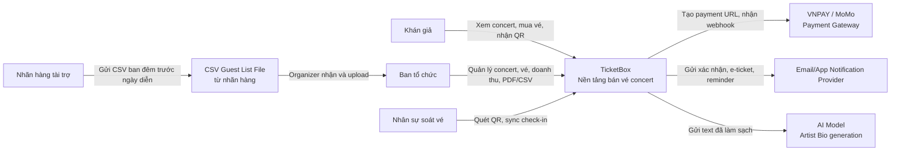
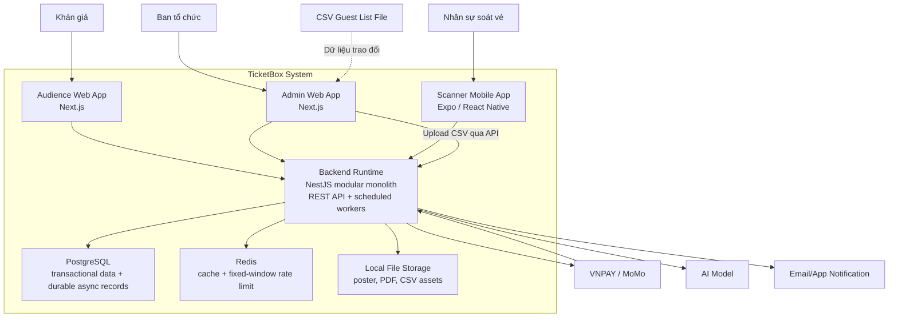

# 2. C4 Diagram

Các sơ đồ C4 dưới đây mô tả actor, ranh giới hệ thống, container triển khai và cách TicketBox giao tiếp với hệ thống ngoài. Dependency chi tiết giữa các domain module và topology triển khai được quản lý tại [03-high-level-architecture.md](03-high-level-architecture.md).

## Level 1 - System Context

### Diễn giải

TicketBox là hệ thống trung tâm. Khán giả, ban tổ chức và nhân sự soát vé tương tác trực tiếp với TicketBox. Các dependency ngoài gồm payment gateway, notification provider, AI model và CSV file do nhãn hàng cung cấp. Payment có request/redirect cùng callback/IPN; AI xử lý bằng durable job; CSV được organizer upload và publish theo transaction; notification không ảnh hưởng kết quả mua vé.

## Level 2 - Container

### Công nghệ đề xuất theo container/data store

| Container/data store | Công nghệ | Giao tiếp chính |
|---|---|---|
| Audience/Admin Web | Next.js | HTTPS tới Backend API, cache public page khi phù hợp. |
| Scanner Mobile App | Expo / React Native | HTTPS khi online, AsyncStorage lưu bền manifest, queue và local checked-in set. |
| Backend Runtime | NestJS modular monolith | REST, in-process domain calls, scheduled workers, PostgreSQL transaction và Redis. |
| PostgreSQL | SQL database | Transaction, constraint, index, lock và durable async state. |
| Redis | In-memory data store | Cache-aside và fixed-window counters; bounded sale admission là hạng mục hardening còn lại. |
| Local File Storage | Persistent filesystem | Lưu poster, PDF và CSV trong demo single-writer; object storage dùng khi chạy nhiều replica. |

## Phạm vi của sơ đồ C4

- Level 1 trả lời TicketBox phục vụ ai và tích hợp với hệ thống ngoài nào.
- Level 2 trả lời các container triển khai chính và trách nhiệm tổng quát của chúng. Các domain module nằm trong Backend API, không phải các microservice độc lập.
- Domain dependency, checkout critical path, topology Docker Compose và trade-off triển khai nằm tại [03-high-level-architecture.md](03-high-level-architecture.md).
- Luồng xử lý theo từng nghiệp vụ nằm tại [05-business-flows.md](05-business-flows.md).
