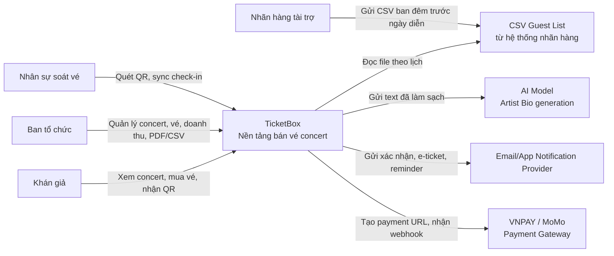
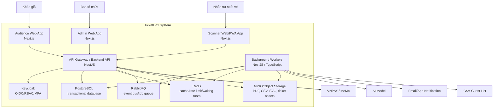

# 2. C4 Diagram

Các sơ đồ C4 dưới đây mô tả actor, ranh giới hệ thống, container logic và cách TicketBox giao tiếp với hệ thống ngoài. Dependency chi tiết giữa domain service và topology triển khai được quản lý tại [03-high-level-architecture.md](03-high-level-architecture.md).

## Level 1 - System Context

### Diễn giải

TicketBox là hệ thống trung tâm. Khán giả, ban tổ chức và nhân sự soát vé tương tác trực tiếp với TicketBox. Các hệ thống ngoài gồm payment gateway, notification provider, AI model và nguồn CSV guest list. Tích hợp payment cần đồng bộ và có webhook; AI và CSV là luồng bất đồng bộ; notification không được ảnh hưởng đến kết quả mua vé.

## Level 2 - Container

### Công nghệ đề xuất theo container

| Container | Công nghệ | Giao tiếp chính |
|---|---|---|
| Audience/Admin Web | Next.js | HTTPS tới API Gateway, cache public page ở edge. |
| Scanner Web/PWA App | Next.js PWA | HTTPS khi online, IndexedDB mã hóa khi offline. |
| Backend API | NestJS | REST, transaction PostgreSQL, Redis, RabbitMQ. |
| Workers | NestJS/TypeScript | RabbitMQ consumer, gọi AI/email/CSV/object storage. |
| PostgreSQL | SQL database | Transaction, constraint, index, lock cho consistency. |
| Redis | In-memory data store | Cache-aside, token bucket, waiting room token. |
| RabbitMQ | Message broker | Retry, DLQ, asynchronous workflow. |
| MinIO | Object storage | Lưu file lớn và asset versioned. |
| Keycloak | OIDC provider | Login, JWT/session, role, MFA. |

## Phạm vi của sơ đồ C4

- Level 1 trả lời TicketBox phục vụ ai và tích hợp với hệ thống ngoài nào.
- Level 2 trả lời các container logic chính và trách nhiệm tổng quát của chúng.
- Domain dependency, checkout critical path, topology Kubernetes và trade-off triển khai nằm tại [03-high-level-architecture.md](03-high-level-architecture.md).
- Luồng xử lý theo từng nghiệp vụ nằm tại [05-business-flows.md](05-business-flows.md).
