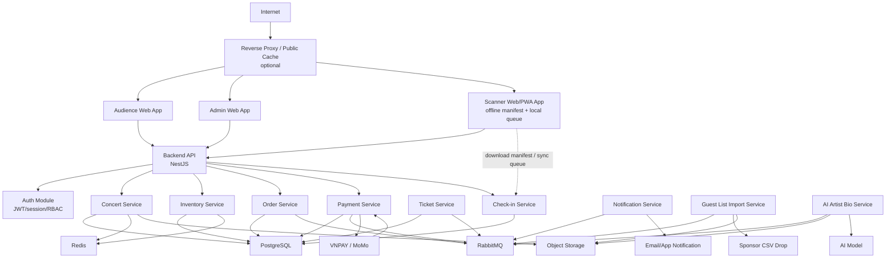
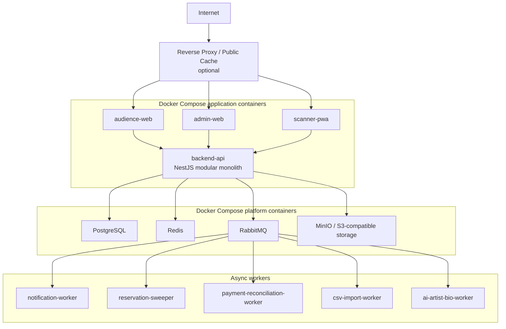

# 3. High-Level Architecture Diagram

Mục tiêu của phần này là mô tả dependency chi tiết giữa domain service, critical path, điểm tích hợp và topology triển khai. Actor, system context và container logic cấp cao được quản lý tại [02-c4-diagrams.md](02-c4-diagrams.md).

## Sơ đồ tổng quan

## Các điểm tích hợp quan trọng

| Tích hợp | Luồng | Yêu cầu thiết kế |
|---|---|---|
| VNPAY/MoMo | Payment Service tạo payment intent/URL, gateway gửi webhook/callback. | Verify signature, idempotency key, payment state machine, reconciliation khi timeout. |
| AI model | AI Artist Bio Service gửi text đã clean để sinh bio ngắn. | Async job, retry/backoff, lưu draft, admin review trước publish. |
| CSV guest list | Import service đọc file CSV theo lịch từ object storage/drop folder. | Staging, validate, dedupe, publish version mới khi batch hợp lệ. |
| Scanner offline | Scanner PWA tải signed manifest, ghi local queue, sync lại khi online. | QR signed token, local durable storage, idempotent sync, conflict policy. |

## Luồng phụ thuộc khi checkout

Checkout phụ thuộc vào Auth, Inventory, Order, Payment và database transaction. Notification, analytics và email chỉ chạy sau qua queue. Nếu notification lỗi, checkout không rollback. Nếu payment gateway lỗi, hệ thống dừng bước thanh toán nhưng vẫn giữ được read path cho concert.

## Topology triển khai khuyến nghị

| Layer | Khuyến nghị |
|---|---|
| Public edge | Reverse proxy/cache là tùy chọn cho demo; Next.js/Backend API vẫn phải hoạt động trực tiếp qua Docker Compose. |
| Runtime | Docker Compose chạy audience web, admin web, scanner PWA, backend API, worker và platform containers. |
| Database | PostgreSQL single instance cho đồ án; backup script hoặc dump hướng dẫn trong README. |
| Redis | Redis single instance cho cache, rate limit, waiting room token và inventory summary gần realtime. |
| RabbitMQ | Durable queue, retry và DLQ cho event/job quan trọng. |
| Object storage | MinIO hoặc S3-compatible storage cho PDF/CSV/seating map/ticket assets. |
| Monitoring cơ bản | Structured logs, health checks, metrics endpoint và dashboard tối thiểu nếu có thời gian. |

## Trade-off chính

| Tiêu chí | Lợi ích | Rủi ro/chi phí | Cách giảm rủi ro |
|---|---|---|---|
| Kiểm soát hạ tầng | Chủ động cấu hình networking, data locality, version, scaling. | Team phải chịu trách nhiệm vận hành nhiều container. | Docker Compose, `.env` rõ ràng, runbook tối giản. |
| Chi phí | Dễ chạy local và demo bằng container OSS. | DB/broker/cache vẫn tiêu tốn tài nguyên máy local. | Chỉ bật thành phần cần demo, seed data gọn. |
| Consistency | PostgreSQL transaction giúp reservation/payment dễ kiểm soát. | Hot row inventory có thể nghẽn dưới concurrent write lớn. | Waiting room, short transaction, row-level lock tối ưu, partition theo ticket type/concert. |
| Vận hành sự kiện | Có thể build dashboard và runbook sát nhu cầu vận hành. | Cần trực ca, log, backup/restore nếu chạy thật. | Sale-day checklist, load test nhỏ và hướng dẫn xử lý sự cố cơ bản. |
