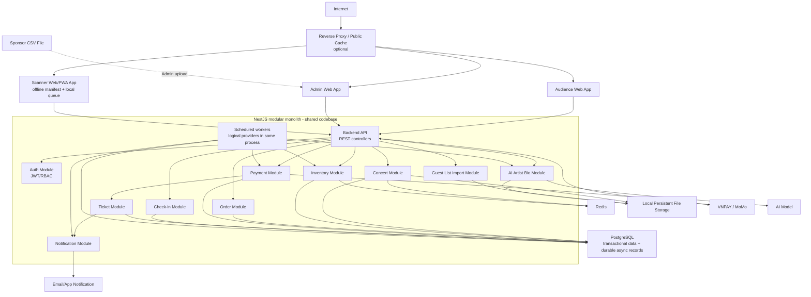
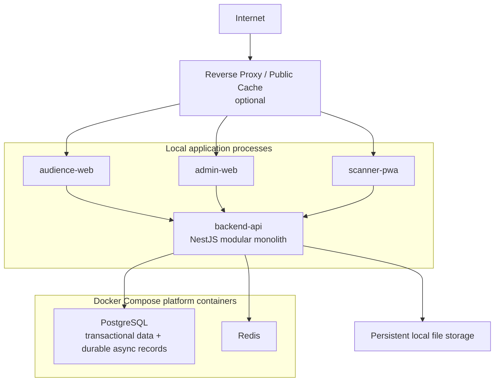

# 3. High-Level Architecture Diagram

Mục tiêu của phần này là mô tả dependency giữa các domain module trong modular monolith, critical path, điểm tích hợp và topology triển khai. Actor, system context và container cấp cao được quản lý tại [02-c4-diagrams.md](02-c4-diagrams.md).

## Sơ đồ tổng quan

## Các điểm tích hợp quan trọng

| Tích hợp | Luồng | Yêu cầu thiết kế |
|---|---|---|
| VNPAY/MoMo | Payment Module tạo payment intent/URL, gateway gửi webhook/callback tới Backend API. | Verify signature, idempotency key, payment state machine, reconciliation khi timeout. |
| AI model | AI Artist Bio Module gửi text đã clean để sinh bio ngắn. | Async job, retry/backoff, lưu draft, admin review trước publish. |
| CSV guest list | Organizer upload CSV qua Admin Web/API; Guest List Module lưu raw file, staging, validate và publish active version. | Full-snapshot semantics, checksum idempotency, all-or-nothing publish; scheduled drop-folder import là hướng bổ sung. |
| Scanner offline | Scanner PWA tải manifest có scope/version/TTL, ghi IndexedDB queue và sync lại khi online. | Signed QR, durable local state, idempotent sync và backend first-wins conflict policy. |

## Luồng phụ thuộc khi checkout

Checkout phụ thuộc vào Auth, Inventory, Order và Payment Module trong cùng modular monolith. Reservation/quota được bảo vệ bằng PostgreSQL row lock. Khi payment được xác minh, Payment Module confirm reservation, cập nhật inventory/quota và gọi Ticket Module phát hành vé idempotent trong cùng transaction. Notification records được tạo sau đó và scheduled worker gửi bất đồng bộ; notification lỗi không rollback ticket. Payment gateway lỗi không ảnh hưởng public concert read path.

## Topology triển khai khuyến nghị

| Layer | Khuyến nghị |
|---|---|
| Public edge | Reverse proxy/public cache là tùy chọn; local apps gọi Backend API trực tiếp, còn Docker Compose hiện chỉ chạy PostgreSQL/Redis. |
| Runtime | Audience web, admin web và scanner PWA gọi một NestJS Backend Runtime; scheduled workers chạy trong cùng process cho demo. |
| Database | PostgreSQL single instance cho đồ án; backup script hoặc dump hướng dẫn trong README. |
| Redis | Redis single instance cho cache, fixed-window rate limit và inventory summary gần realtime. |
| PostgreSQL durable async state | Payment reconciliation fields/events, notification records, guest-list outbox và AI jobs nằm trong cùng database. |
| File storage | Local persistent filesystem đúng với implementation single-writer; MinIO/S3-compatible storage chỉ cần khi chạy nhiều backend replica. |
| Monitoring cơ bản | Structured logs, health checks, metrics endpoint và dashboard tối thiểu nếu có thời gian. |

## Trade-off chính

| Tiêu chí | Lợi ích | Rủi ro/chi phí | Cách giảm rủi ro |
|---|---|---|---|
| Kiểm soát hạ tầng | Chủ động cấu hình networking, data locality, version, scaling. | Team phải chịu trách nhiệm vận hành nhiều container. | Docker Compose, `.env` rõ ràng, runbook tối giản. |
| Chi phí | Dễ chạy local và demo bằng container OSS. | DB/cache và worker polling vẫn tiêu tốn tài nguyên máy local. | Chỉ bật thành phần cần demo, seed data gọn. |
| Consistency | PostgreSQL transaction giúp reservation/payment dễ kiểm soát. | Hot row inventory có thể nghẽn dưới concurrent write lớn. | Demo dùng transaction ngắn, row-level lock, multi-scope rate limit và risk guard; bounded admission là hardening bổ sung. |
| Vận hành sự kiện | Có thể build dashboard và runbook sát nhu cầu vận hành. | Cần trực ca, log, backup/restore nếu chạy thật. | Sale-day checklist, load test nhỏ và hướng dẫn xử lý sự cố cơ bản. |
