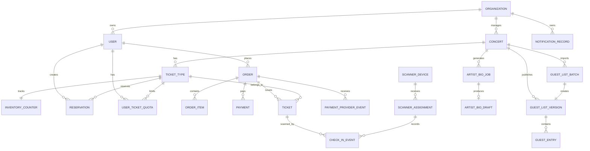

# 4. Thiết kế cơ sở dữ liệu

Tài liệu này là source of truth cho schema, invariant dữ liệu và transaction algorithm của các luồng ghi quan trọng. Các tài liệu khác chỉ tham chiếu hoặc giải thích lý do thiết kế, không định nghĩa lại các invariant này.

## Lựa chọn database

TicketBox dùng PostgreSQL làm database chính vì các luồng quan trọng cần transaction, lock, unique constraint và consistency mạnh: giữ vé, quota, payment, ticket và check-in. Redis dùng cho cache/fixed-window rate limit, không quyết định bán vé. Local persistent filesystem lưu PDF, CSV, poster và SVG trong demo single-writer; shared object storage là hướng multi-replica.

| Nhóm dữ liệu | Lưu ở đâu | Lý do |
|---|---|---|
| User, role, organization | PostgreSQL | Cần quan hệ, RBAC, ownership check và audit quyền. |
| Concert, venue, ticket type | PostgreSQL | Dữ liệu nghiệp vụ có quan hệ rõ. |
| Inventory, reservation, quota | PostgreSQL | Cần transaction để không oversell và không vượt quota. |
| Order, payment, ticket | PostgreSQL | Cần state machine, idempotency, audit. |
| Check-in event | PostgreSQL | Cần idempotency và conflict resolution. |
| Guest list | PostgreSQL + file storage | Raw CSV lưu local file; staging/version/entry đã validate lưu DB. |
| PDF/ảnh/SVG asset | Local file storage | Binary không lưu trực tiếp trong transactional DB; object storage dùng khi scale nhiều replica. |
| Concert cache/inventory summary | Redis | Đọc nhiều, TTL ngắn, không phải source of truth. |

## ER diagram



## Entity quan trọng

### `users`

| Cột | Kiểu | Ghi chú |
|---|---|---|
| `id` | UUID | Primary key. |
| `organization_id` | UUID nullable | Ban tổ chức/scanner thuộc organization nào. |
| `email` | text unique | Đăng nhập và thông báo. |
| `role` | enum | `audience`, `organizer`, `scanner`, `system_admin`, `service_account`; service account hiện chỉ là schema reservation cho integration tương lai. |
| `password_hash` | text | Mật khẩu đã hash; không lưu mật khẩu gốc. |
| `status` | enum | active/disabled. |

### `organizations`

| Cột | Kiểu | Ghi chú |
|---|---|---|
| `id` | UUID | Primary key. |
| `name` | text | Tên đơn vị tổ chức. |

### `concerts`

| Cột | Kiểu | Ghi chú |
|---|---|---|
| `id` | UUID | Primary key. |
| `organization_id` | UUID | Chủ sở hữu concert. |
| `title` | text | Tên concert. |
| `slug` | text unique | URL public ổn định. |
| `venue` | text | Địa điểm. |
| `artist_name` | text | Tên nghệ sĩ hoặc tên nhóm biểu diễn. |
| `description` | text nullable | Nội dung mô tả concert. |
| `start_at` | timestamptz | Thời gian diễn. |
| `status` | enum | draft/published/canceled. |
| `seating_map_object_key` | text | Key/path SVG trong file storage. |
| `published_artist_bio` | text | Bio đã duyệt. |
| `published_artist_profiles` | json | Danh sách nghệ sĩ đã duyệt từ AI pipeline. |
| `poster_object_key` | text nullable unique | Poster trong local file storage. |

### `ticket_types`

| Cột | Kiểu | Ghi chú |
|---|---|---|
| `id` | UUID | Primary key. |
| `concert_id` | UUID | Thuộc concert. |
| `slug` | text | URL ổn định trong phạm vi concert. |
| `zone_code` | text | GA/SVIP/VIP/CAT1/CAT2. |
| `name` | text | Tên loại vé. |
| `price` | numeric | Giá vé. |
| `capacity` | int | Tổng số vé. |
| `per_user_limit` | int | Giới hạn mỗi user. |
| `sale_start_at`, `sale_end_at` | timestamptz | Sale window. |

### `inventory_counters`

| Cột | Kiểu | Ghi chú |
|---|---|---|
| `ticket_type_id` | UUID | Primary key. |
| `total_capacity` | int | Tổng số lượng vé có. |
| `reserved_count` | int | Vé đang giữ còn TTL. |
| `sold_count` | int | Vé đã thanh toán/phát hành. |
| `version` | int | Optimistic locking nếu cần. |

Mỗi ticket type phải có đúng một row `inventory_counters`.

Khi tạo ticket type, backend phải tạo `ticket_types` và `inventory_counters` trong cùng một database transaction.

Khi thay đổi capacity, `ticket_types.capacity` và
`inventory_counters.total_capacity` phải được cập nhật trong cùng một database transaction.

Giá trị inventory ban đầu:
inventory_counters.total_capacity = ticket_types.capacity
inventory_counters.reserved_count = 0
inventory_counters.sold_count = 0

Invariant bắt buộc:
```
inventory_counters.total_capacity = ticket_types.capacity

inventory_counters.sold_count + inventory_counters.reserved_count <= inventory_counters.total_capacity

user_ticket_quotas.reserved_count + user_ticket_quotas.paid_count <= ticket_types.per_user_limit

one successful payment confirmation issues ticket exactly once
one ticket can have at most one accepted check-in
```

### `reservations`

| Cột | Kiểu | Ghi chú |
|---|---|---|
| `id` | UUID | Primary key. |
| `user_id` | UUID | Người giữ vé. |
| `ticket_type_id` | UUID | Loại vé. |
| `quantity` | int | Số vé giữ. |
| `order_id` | UUID nullable | Gắn với order sau khi tạo. |
| `status` | enum | active/confirmed/released/expired. |
| `expires_at` | timestamptz | TTL giữ vé. |
| `idempotency_key` | text | Chống submit trùng. |

Unique đề xuất: `(user_id, idempotency_key)`.

### `user_ticket_quotas`

| Cột | Kiểu | Ghi chú |
|---|---|---|
| `user_id` | UUID | Người mua. |
| `ticket_type_id` | UUID | Loại vé. |
| `reserved_count` | int | Vé đang giữ. |
| `paid_count` | int | Vé đã mua thành công. |

Primary key: `(user_id, ticket_type_id)`.

### Transaction giữ vé

Inventory là phần cần consistency cao nhất. Checkout không được dựa vào Redis/cache để quyết định bán vé.

Trong transaction tạo reservation:
1. Lock row `inventory_counters` bằng `SELECT ... FOR UPDATE`, hoặc dùng optimistic update `WHERE available >= quantity`. ( `available = total_capacity - reserved_count - sold_count`)
2. Lock/upsert row `user_ticket_quotas`.
3. Kiểm tra sale window hợp lệ.
4. Kiểm tra `available >= quantity`.
5. Kiểm tra quota sau khi cộng reservation không vượt `per_user_limit`.
6. Insert reservation có TTL.
7. Update `reserved_count` và quota reserved.

Khi payment thành công đã được verify, transaction confirm sẽ chuyển reservation sang `confirmed`, chuyển inventory từ reserved sang sold, chuyển quota reserved sang paid và phát hành ticket idempotent. Ticket issuance dùng unique `(order_item_id, sequence_no)` nên webhook/reconciliation retry không tạo vé trùng. Notification record được tạo sau transaction; lỗi notification không rollback ticket.

Webhook/reconciliation và sweeper phải dùng cùng lock order `reservation -> order -> payment` hoặc conditional update tương đương. Nếu reservation đã hết hạn hoặc order đã `expired`, payment success vẫn được lưu nhưng order chuyển `refund_required` và không phát hành ticket.

Reservation TTL mặc định: ví dụ 10-15 phút.
Sweeper chạy định kỳ, chỉ xử lý reservation có:
- status = active
- expires_at < now()
Dùng SELECT ... FOR UPDATE SKIP LOCKED để batch an toàn.
Khi expire:
- reservations.status: active -> expired
- inventory_counters.reserved_count giảm quantity
- user_ticket_quotas.reserved_count giảm quantity
- orders.status: pending_payment -> expired nếu chưa payment success

### Mở rộng khi PostgreSQL thành bottleneck

| Vấn đề | Cách xử lý |
|---|---|
| Row lock nóng trên ticket type SVIP | Dùng fixed-window rate/risk protection và bounded admission khi campaign hot để giới hạn write concurrency. |
| Retry transaction quá nhiều | Giới hạn concurrency theo `ticket_type_id` ở API/worker; nếu cần mở rộng sau, có thể tách command processor chuyên trách. |
| Dashboard/reporting ảnh hưởng primary | Demo query PostgreSQL trực tiếp bằng aggregate có index; read replica/read model chỉ dùng khi dữ liệu production đủ lớn. |
| Số concert/ticket type lớn | Partition/shard theo `concert_id` và `ticket_type_id` nếu cần. |

### `orders`, `payments`, `tickets`

| Entity | Trường chính | Ghi chú |
|---|---|---|
| `orders` | `id`, `user_id`, `status`, `total_amount`, `idempotency_key`, buyer contact | State: `pending_payment`, `paid`, `issued`, `failed`, `expired`, `refund_required`. `refund_required` là queue vận hành của demo; provider refund tự động là hướng mở rộng. |
| `payments` | `id`, `order_id`, `provider`, provider intent/transaction ids, status, reconciliation lease/attempt fields, `payload_hash` | State: `created`, `pending`, `pending_reconciliation`, `succeeded`, `failed`, `expired`. Unique `(order_id, provider)` và `(provider, provider_txn_id)`. |
| `tickets` | `id`, `order_id`, `order_item_id`, `ticket_type_id`, `owner_user_id`, `qr_token_hash`, `sequence_no`, `status` | `UNIQUE(order_item_id,sequence_no)`, `UNIQUE(qr_token_hash)`. QR chứa signed token hoặc ticket id + signature. State: issued, revoked, checked_in |

### Idempotency và payment provider events

| Entity | Mục đích |
|---|---|
| `idempotency_records` | Scope theo `(user_id, endpoint, key)`, lưu request hash, processing lease và response replay cho reservation/payment intent. |
| `payment_provider_events` | Dedupe webhook/callback theo `(provider, provider_event_id)`, lưu provider transaction id, payload hash, trạng thái processed/rejected và response replay. |

### `order_items`

| Cột | Kiểu | Ghi chú |
|---|---|---|
|`id` |UUID | Primary Key |
|`order_id`| UUID | FK |
|`reservation_id` | UUID | FK |
|`ticket_type_id`| UUID | FK |
|`quantity`| int | |
|`unit_price`| numeric| |
|`subtotal_amount`| numeric| |
|`status`| enum| pending, confirmed, refunded|

### `check_in_events`

| Cột | Kiểu | Ghi chú |
|---|---|---|
| `id` | UUID | Primary key. |
| `ticket_id` | UUID nullable | Vé thường được scan; null với guest-list entry. |
| `ticket_ref` | text | Định danh chung cho ticket hoặc guest entry trong manifest. |
| `scanner_user_id` | UUID | Nhân sự soát vé. |
| `device_id` | text | Thiết bị scanner. |
| `client_event_id` | text unique | Event id ổn định do scanner tạo trước khi ghi local. |
| `assignment_id`, `device_id` | UUID | Scope scanner/device đã được cấp. |
| `event_id`, `gate_code`, `zone_code`, `manifest_version` | text/int | Scope sự kiện và manifest tại thời điểm scan. |
| `result` | enum | accepted/conflict/rejected. |
| `client_scanned_at`, `server_recorded_at` | timestamptz | Thời gian scan phía client và ghi nhận phía server. |
| `winning_event_id` | UUID nullable | Event accepted trước đó khi kết quả là conflict. |

Backend serialize check-in theo `(event_id, ticket_ref)` bằng transaction/advisory lock. Event đầu tiên hợp lệ được `accepted`; event sau cùng ref trả `conflict`. `ticket_ref` cho phép cùng cơ chế xử lý cả e-ticket và guest-list entry mà không cần polymorphic foreign key.

### Guest list

| Entity | Mục đích |
|---|---|
| `guest_list_batches` | Lưu checksum/schema version, raw file key, status và summary của mỗi lần import. |
| `guest_entries_staging` | Lưu từng dòng parse/validate cùng row number, normalized identity và lỗi. |
| `guest_list_versions` | Mỗi batch hợp lệ tạo một version; chỉ một version active theo concert. |
| `guest_entries` | Full snapshot khách đã validate thuộc một version. |
| `guest_list_outbox` | Durable `GuestListUpdated` record để các projection/manifest biết version mới. |

CSV được hiểu là full snapshot. Duplicate chỉ bị từ chối trong cùng file; identity đã có ở version trước không phải lỗi vì version mới thay thế toàn bộ snapshot cũ.

### Scanner, notification và AI jobs

| Entity | Mục đích |
|---|---|
| `scanner_devices`, `scanner_assignments` | Bind scanner user/device với concert, gate, zone và manifest version/TTL. |
| `scanner_manifest_tickets`, `scanner_revoked_tickets`, `scanner_guest_entries` | Payload manifest được phân vùng theo assignment. |
| `notification_records` | Durable delivery task theo channel `in_app`/`email`, có idempotency key, scheduled time và trạng thái pending/sent/failed. |
| `artist_bio_jobs` | Job lease/retry, checksum/pipeline version, extracted/sanitized text và provider/model/prompt version. |
| `artist_bio_drafts` | Draft gắn duy nhất với job, chờ organizer review/publish. |
