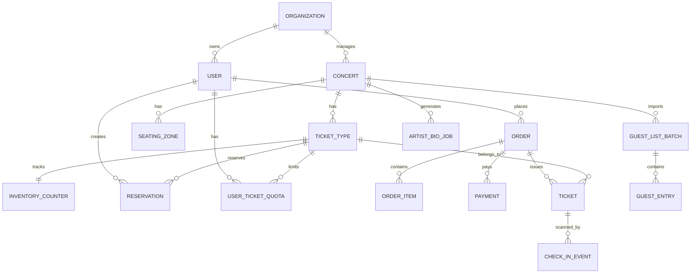

# 4. Thiết kế cơ sở dữ liệu

Tài liệu này là source of truth cho schema, invariant dữ liệu và transaction algorithm của các luồng ghi quan trọng. Các tài liệu khác chỉ tham chiếu hoặc giải thích lý do thiết kế, không định nghĩa lại các invariant này.

## Lựa chọn database

TicketBox nên dùng PostgreSQL làm database chính vì các luồng quan trọng cần transaction, lock, unique constraint và consistency mạnh: giữ vé, giới hạn vé theo user, payment, phát hành ticket và check-in. Redis được dùng làm cache/rate-limit/waiting-room, không dùng làm nguồn quyết định bán vé. Object storage dùng cho file lớn như PDF, CSV, ảnh và SVG seating map.

| Nhóm dữ liệu | Lưu ở đâu | Lý do |
|---|---|---|
| User, role, organization | PostgreSQL/Keycloak | Cần quan hệ và audit quyền. |
| Concert, venue, ticket type | PostgreSQL | Dữ liệu nghiệp vụ có quan hệ rõ. |
| Inventory, reservation, quota | PostgreSQL | Cần transaction để không oversell và không vượt quota. |
| Order, payment, ticket | PostgreSQL | Cần state machine, idempotency, audit. |
| Check-in event | PostgreSQL | Cần idempotency và conflict resolution. |
| Guest list | PostgreSQL + object storage | CSV raw lưu object storage; bản đã validate lưu DB. |
| PDF/ảnh/SVG/ticket asset | Object storage | File lớn, versioned, không nên lưu trực tiếp trong DB. |
| Concert cache/inventory summary | Redis | Đọc nhiều, TTL ngắn, không phải source of truth. |

## ER diagram



## Entity quan trọng

### `users`

| Cột | Kiểu | Ghi chú |
|---|---|---|
| `id` | UUID | Primary key. |
| `organization_id` | UUID nullable | Ban tổ chức/scanner thuộc organization nào. |
| `email` | text unique | Đăng nhập và thông báo. |
| `role` | enum | `audience`, `organizer`, `scanner`, `system_admin`. |
| `status` | enum | active/disabled. |

### `concerts`

| Cột | Kiểu | Ghi chú |
|---|---|---|
| `id` | UUID | Primary key. |
| `organization_id` | UUID | Chủ sở hữu concert. |
| `title` | text | Tên concert. |
| `venue` | text | Địa điểm. |
| `start_at` | timestamptz | Thời gian diễn. |
| `status` | enum | draft/published/canceled. |
| `seating_map_object_key` | text | SVG trong object storage. |
| `published_artist_bio` | text | Bio đã duyệt. |

### `ticket_types`

| Cột | Kiểu | Ghi chú |
|---|---|---|
| `id` | UUID | Primary key. |
| `concert_id` | UUID | Thuộc concert. |
| `zone_code` | text | GA/SVIP/VIP/CAT1/CAT2. |
| `name` | text | Tên loại vé. |
| `price` | numeric | Giá vé. |
| `capacity` | int | Tổng số vé. |
| `per_user_limit` | int | Giới hạn mỗi user. |
| `sale_start_at`, `sale_end_at` | timestamptz | Sale window. |

### `inventory_counters`

| Cột | Kiểu | Ghi chú |
|---|---|---|
| `ticket_type_id` | UUID | Primary key. |
| `total_capacity` | int | Tổng số lượng vé có. |
| `reserved_count` | int | Vé đang giữ còn TTL. |
| `sold_count` | int | Vé đã thanh toán/phát hành. |
| `version` | int | Optimistic locking nếu cần. |

Invariant bắt buộc:

```text
sold_count + active_reserved_count <= total_capacity
paid_user_ticket_count + active_reserved_user_ticket_count <= configured_user_limit
one successful payment confirmation issues ticket exactly once
one ticket can have at most one accepted check-in
```

### `reservations`

| Cột | Kiểu | Ghi chú |
|---|---|---|
| `id` | UUID | Primary key. |
| `user_id` | UUID | Người giữ vé. |
| `ticket_type_id` | UUID | Loại vé. |
| `quantity` | int | Số vé giữ. |
| `order_id` | UUID nullable | Gắn với order sau khi tạo. |
| `status` | enum | active/confirmed/released/expired. |
| `expires_at` | timestamptz | TTL giữ vé. |
| `idempotency_key` | text | Chống submit trùng. |

Unique đề xuất: `(user_id, idempotency_key)`.

### `user_ticket_quotas`

| Cột | Kiểu | Ghi chú |
|---|---|---|
| `user_id` | UUID | Người mua. |
| `ticket_type_id` | UUID | Loại vé. |
| `reserved_count` | int | Vé đang giữ. |
| `paid_count` | int | Vé đã mua thành công. |

Primary key: `(user_id, ticket_type_id)`.

### Transaction giữ vé

Inventory là phần cần consistency cao nhất. Checkout không được dựa vào Redis/cache để quyết định bán vé.

Trong transaction tạo reservation:
1. Lock row `inventory_counters` bằng `SELECT ... FOR UPDATE`, hoặc dùng optimistic update `WHERE available >= quantity`. ( `available = total_capacity - reserved_count - sold_count`)
2. Lock/upsert row `user_ticket_quotas`.
3. Kiểm tra sale window hợp lệ.
4. Kiểm tra `available >= quantity`.
5. Kiểm tra quota sau khi cộng reservation không vượt `per_user_limit`.
6. Insert reservation có TTL.
7. Update `reserved_count` và quota reserved.

Khi payment thành công, transaction confirm sẽ chuyển reservation sang sold và chuyển quota reserved sang paid.

Reservation TTL mặc định: ví dụ 10-15 phút.
Sweeper chạy định kỳ, chỉ xử lý reservation có:
- status = active
- expires_at < now()
Dùng SELECT ... FOR UPDATE SKIP LOCKED để batch an toàn.
Khi expire:
- reservations.status: active -> expired
- inventory_counters.reserved_count giảm quantity
- user_ticket_quotas.reserved_count giảm quantity
- orders.status: pending_payment -> expired nếu chưa payment success

### Mở rộng khi PostgreSQL thành bottleneck

| Vấn đề | Cách xử lý |
|---|---|
| Row lock nóng trên ticket type SVIP | Dùng waiting room để giới hạn write concurrency vào ticket type hot. |
| Retry transaction quá nhiều | Serialize command cực hot bằng RabbitMQ theo `ticket_type_id`. |
| Dashboard/reporting ảnh hưởng primary | Dùng read replica hoặc read model riêng. |
| Số concert/ticket type lớn | Partition/shard theo `concert_id` và `ticket_type_id` nếu cần. |

### `orders`, `payments`, `tickets`

| Entity | Trường chính | Ghi chú |
|---|---|---|
| `orders` | `id`, `user_id`, `status`, `total_amount`, `idempotency_key` | State: pending, paid, issued, failed, expired, refunded. |
| `payments` | `id`, `order_id`, `provider`, `provider_txn_id`, `status`, `payload_hash` | Webhook idempotent, audit raw payload hash. State: created, pending, succeeded, failed, expired, refunded.  |
| `tickets` | `id`, `order_id`, `order_item_id`, `ticket_type_id`, `owner_user_id`, `qr_token_hash`, `sequence_no`, `status` | `UNIQUE(order_item_id,sequence_no)`, `UNIQUE(qr_token_hash)`. QR chứa signed token hoặc ticket id + signature. State: issued, revoked, checked_in |

### `order_items`

| Cột | Kiểu | Ghi chú |
|---|---|---|
|`id` |UUID | Primary Key |
|`order_id`| UUID | FK |
|`reservation_id` | UUID | FK |
|`ticket_type_id`| UUID | FK |
|`quantity`| int | |
|`unit_price`| numeric| |
|`subtotal_amount`| numeric| |
|`status`| enum| pending, confirmed, refunded|

### `check_in_events`

| Cột | Kiểu | Ghi chú |
|---|---|---|
| `id` | UUID | Primary key. |
| `ticket_id` | UUID | Vé được scan. |
| `scanner_user_id` | UUID | Nhân sự soát vé. |
| `device_id` | text | Thiết bị scanner. |
| `event_idempotency_key` | text unique | Chống sync trùng. |
| `mode` | enum | online/offline. |
| `result` | enum | accepted/conflict/rejected. |
| `scanned_at`, `synced_at` | timestamptz | Thời gian scan/sync. |

### `guest_list_batches`, `guest_entries`, `artist_bio_jobs`

| Entity | Mục đích |
|---|---|
| `guest_list_batches` | Lưu batch import CSV, status, file object key, summary lỗi. |
| `guest_entries` | Guest list đã validate theo concert/zone/version. |
| `artist_bio_jobs` | Trạng thái xử lý PDF, extracted text, AI output, review status. |
