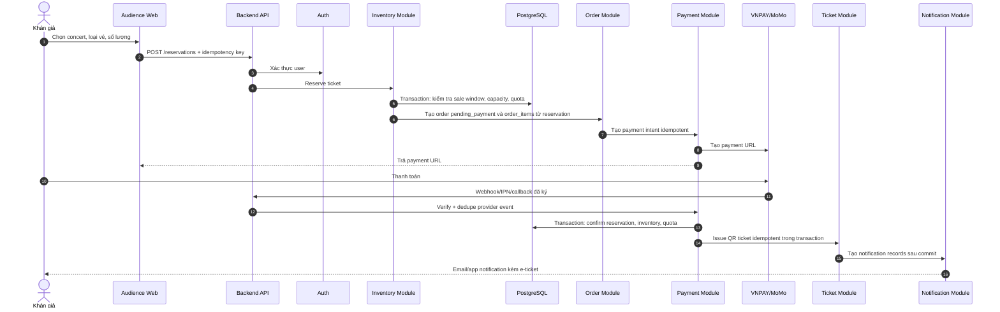
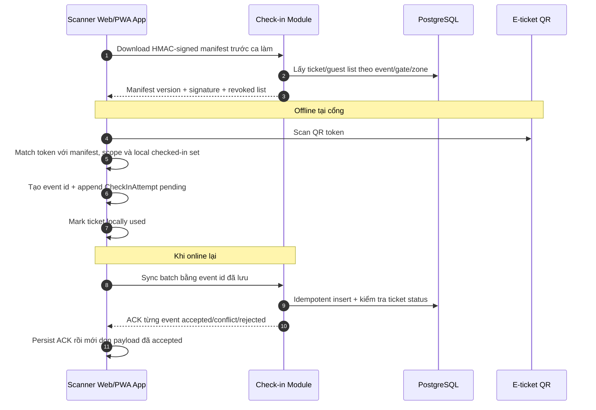
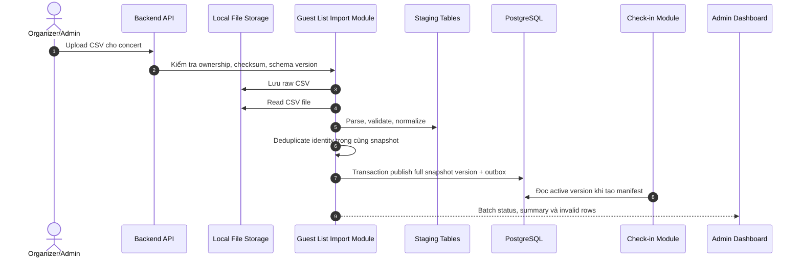
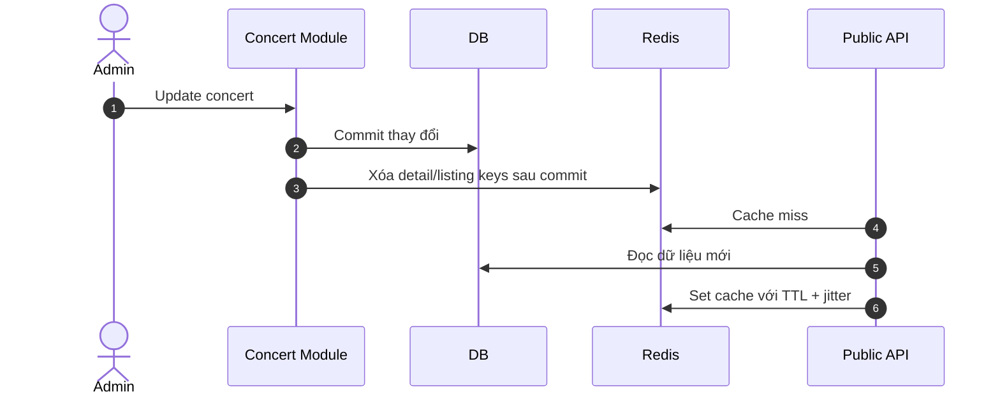
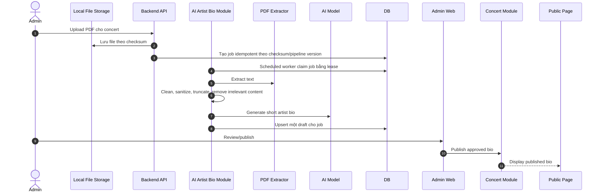

# 5. Mô tả các luồng nghiệp vụ quan trọng

Các luồng trong file này bao phủ các nghiệp vụ rủi ro nhất của TicketBox: mua vé, soát vé offline, nhập guest list CSV, cập nhật cache và AI Artist Bio.

## Luồng mua vé

### Xử lý lỗi giữa chừng

| Lỗi | Hành vi |
|---|---|
| User bấm mua nhiều lần | API kiểm tra idempotency key; request trùng trả lại kết quả cũ. |
| Hết vé khi reserve | Inventory transaction fail, không tạo order/payment. |
| User vượt quota | Lock/upsert `user_ticket_quotas`, reject nếu vượt limit. |
| Payment timeout | Order giữ `pending_payment`, payment chuyển `pending_reconciliation`; worker kiểm tra lại gateway, reservation hết TTL thì release. |
| Webhook gửi nhiều lần | Payment Module dedupe theo `(provider, provider_event_id)` và giữ payload hash để phát hiện replay khác nội dung. |
| Ticket issuing retry | Ticket issuing idempotent; bảng tickets chống trùng từng vé bằng `UNIQUE(order_item_id, sequence_no)` và `UNIQUE(qr_token_hash)`. |
| Notification lỗi | Ghi delivery `failed` cùng error; không rollback ticket đã issued. Automatic retry/manual retry endpoint là hạng mục bổ sung. |
| Payment success sau khi reservation expired | Không issue ticket tự động; payment vẫn `succeeded`, order chuyển `refund_required`. |

## Luồng soát vé khi mất mạng và đồng bộ lại

### Xử lý lỗi giữa chừng

| Lỗi | Hành vi |
|---|---|
| Mất mạng hoàn toàn | App dùng signed manifest và local checked-in set. |
| App crash trước sync | Local queue lưu bền trong IndexedDB nên khởi động lại vẫn sync được. Dữ liệu local được giảm PII; application-level encryption là hardening production. |
| Một vé scan hai lần cùng device | Local checked-in set chặn lần thứ hai. |
| Một vé scan ở hai device offline | Backend nhận sync trước thì accepted; sync sau conflict. |
| Manifest cũ | App bắt buộc refresh trước ca; manifest có version, TTL và revoked list. |
| Batch sync timeout hoặc ACK một phần | App gửi lại event chưa có ACK bằng cùng event id; backend dedupe. |
| Event conflict/rejected | Giữ kết quả local để nhân sự xử lý, không tự xóa như event accepted. |
| Manifest hết TTL hoặc sai scope/checksum | Dừng offline scan và yêu cầu tải manifest hợp lệ. Backend hiện ký HMAC; independent browser verification bằng public key là hạng mục hardening còn lại. |

## Luồng nhập danh sách khách mời từ CSV

### Xử lý lỗi giữa chừng

| Lỗi | Hành vi |
|---|---|
| File không đọc được | Batch `FAILED`, giữ guest list version hiện tại. |
| Dòng thiếu field hoặc sai format | Ghi invalid row vào staging, không publish cả batch và hiển thị error report. |
| Trùng khách trong cùng file | Batch invalid theo normalized identity; active version không đổi. Identity xuất hiện ở version cũ không phải lỗi vì file mới là full snapshot. |
| Batch lỗi nặng | Đánh dấu batch `failed`/`validation_failed`, giữ active version hiện tại và raw file để điều tra. |
| Client retry cùng file | Unique `(concert_id, file checksum, schema version)` trả batch cũ, không tạo version hoặc row trùng. |
| Process lỗi sau DB commit | Active version và `GuestListUpdated` record đã cùng commit; retry cùng checksum trả kết quả idempotent. |

## Luồng cập nhật cache concert

### Xử lý lỗi giữa chừng

| Lỗi | Hành vi |
|---|---|
| Xóa cache lỗi | TTL giúp cache tự hết hạn; structured log ghi lỗi invalidation. |
| Cache stampede | Dùng in-process request coalescing, TTL jitter và DB miss budget. |
| Redis lỗi | Cache-aside fallback DB có concurrency/query budget; trả `503` khi miss budget cạn thay vì dồn tải không giới hạn. |

## Luồng AI Artist Bio

### Xử lý lỗi giữa chừng

| Lỗi | Hành vi |
|---|---|
| PDF lỗi hoặc quá lớn | Reject upload hoặc đưa job vào failed, không ảnh hưởng trang concert. |
| Extract text lỗi | Lưu lỗi job để admin upload lại hoặc nhập bio thủ công. |
| AI model timeout | Retry có giới hạn với backoff/jitter; vượt budget thì vào failed state để admin retry thủ công. |
| AI sinh nội dung không phù hợp | Không auto-publish; admin phải review/edit/publish. |
| Scheduled worker claim lại job | Lease, status và unique `(concert_id, checksum, pipeline_version)` ngăn tạo draft/job trùng. |
| Nội dung PDF cố điều khiển model | Xem PDF là input không tin cậy; sanitize và giữ system instruction cố định. |
