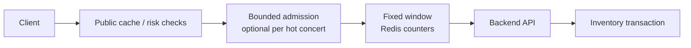
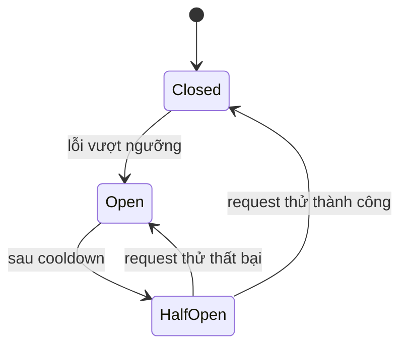
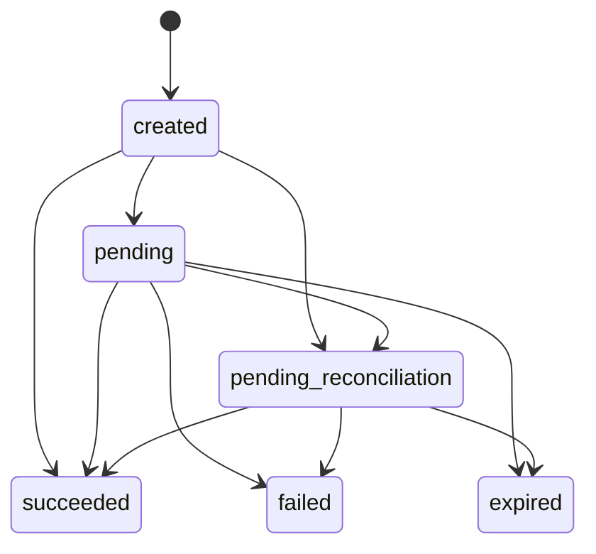
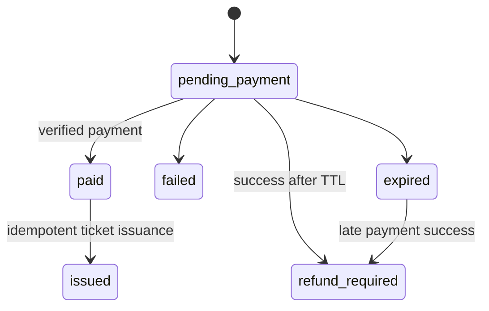
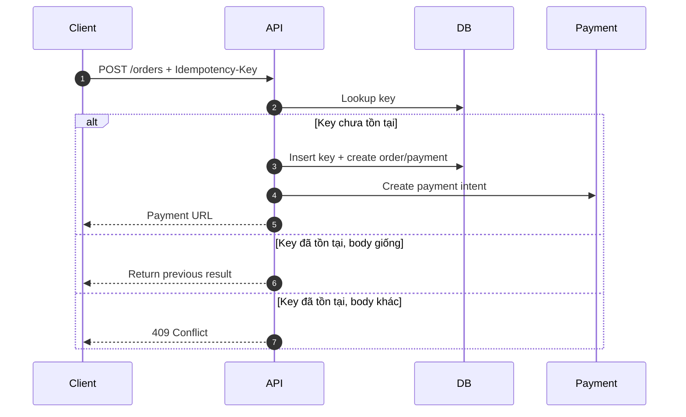
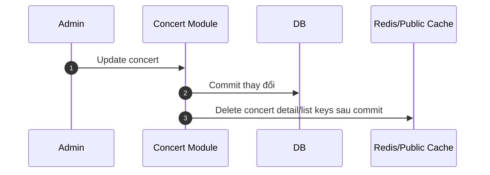
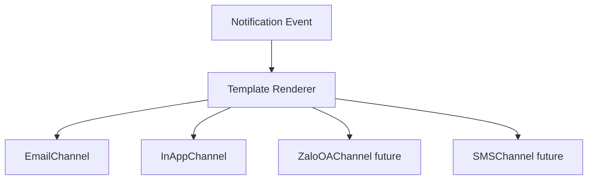
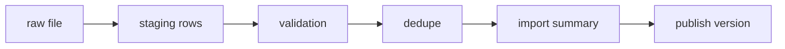

# 7. Thiết kế các cơ chế bảo vệ hệ thống

Tài liệu này tập trung vào các lớp bảo vệ ở biên hệ thống và quanh dependency: admission control, rate limiting, circuit breaker, idempotency, caching và policy xử lý lỗi.

Invariant dữ liệu, schema và transaction algorithm của inventory/quota được quản lý tại [04-database-design.md](04-database-design.md). Các lớp bảo vệ trong file này chỉ giảm tải và giảm request lỗi; chúng không thay thế transaction database.

## Bảo vệ đường ghi inventory và quota

Inventory Module và PostgreSQL vẫn là nơi quyết định request reserve có hợp lệ hay không. Các lớp bên ngoài bảo vệ đường ghi như sau:

| Lớp bảo vệ | Trách nhiệm | Không được làm |
|---|---|---|
| Bounded admission (còn lại) | Giới hạn số user được cấp signed token vào sale hot trong một time window. | Quyết định vé còn/hết hoặc duy trì full queue position. |
| Rate limit | Chặn spam theo IP, user, device và endpoint. | Thay thế kiểm tra quota trong transaction. |
| Idempotency | Làm retry an toàn và trả lại kết quả cũ cho request trùng. | Bỏ qua validation inventory/quota. |
| Admission control/backpressure | Giữ write concurrency trong ngưỡng backend và database chịu được. | Xếp hàng vô hạn hoặc xác nhận reservation trước khi database commit. |

Chi tiết transaction giữ vé và quota ledger: [04-database-design.md](04-database-design.md#transaction-giữ-vé). Lý do và trade-off: [tranh chấp vé cuối cùng](core-design-decisions/last-ticket-contention.md) và [giới hạn vé mỗi tài khoản](core-design-decisions/per-user-ticket-limit.md).

## Kiểm soát tải đột biến

### Giải pháp

Kết hợp nhiều lớp:

1. Public cache cho trang public và static assets.
2. Bounded sale admission cho concert hot là hạng mục hardening bổ sung, không phải full virtual queue.
3. Fixed-window rate limiting bằng Redis `INCR`/TTL ở Backend API.
4. Per-user/per-IP/per-device limit cho endpoint nóng như `/reservations`.
5. Bản đồ án chỉ dùng các risk check đơn giản nếu cần; bot score nhiều tín hiệu và CAPTCHA theo risk score là lớp production tùy chọn.
6. Bounded admission ở backend để từ chối sớm khi connection pool, worker hoặc database gần bão hòa.

### Fixed-window rate limit cho reservation

| Scope | Ví dụ limit | Mục đích |
|---|---:|---|
| IP | 30 request/phút | Chặn spam thô. |
| User | 10 reserve attempts/phút | Chặn bấm liên tục theo tài khoản. |
| Device/session | 20 request/phút | Giảm spam cùng device/session. |
| Ticket type hot | Chưa áp dụng riêng | Bounded admission theo concert/campaign là hạng mục tiếp theo. |

Nếu vượt limit, API trả `429 Too Many Requests` kèm `Retry-After`. Implementation dùng window key theo scope, endpoint và time bucket; khi Redis lỗi, một bounded in-memory counter giữ protection cơ bản cho demo single process.

### Bounded sale admission và sale access token

- Backend/frontend hiện đã có rate limit, risk guard và client plumbing cho sale token; backend admission endpoint/guard là hạng mục hardening còn lại.
- Thiết kế bổ sung chỉ giới hạn số user được cấp quyền vào sale trong một time window; không xây queue position hay full FIFO/randomized virtual queue.
- Sale access token được ký, có `user_id`, `concert_id`, `issued_at`, `expires_at` và scope reservation; token có thể dùng lại trong TTL cho cùng user/concert để không xung đột với idempotent retry.
- Token không chứng minh còn vé và không thay thế transaction inventory/quota.
- Khi admission được bật nhưng Redis không khả dụng, reserve path trả `503`/`429` có `Retry-After`; public read path vẫn fallback theo cache policy.

### Backpressure và overload response

- Mỗi tầng có concurrency limit và backlog/admission depth tối đa theo capacity test.
- Request chưa được nhận vào xử lý bị từ chối sớm bằng `429` hoặc `503` kèm `Retry-After`; không giữ HTTP connection chờ vô hạn.
- Client retry bằng cùng idempotency key, exponential backoff có jitter và tôn trọng `Retry-After`.
- Nếu dùng worker/command processor để serialize command cực nóng trong tương lai, API chỉ trả thành công sau khi reservation đã commit; ghi job không đồng nghĩa đã giữ được vé.

## Xử lý cổng thanh toán không ổn định

### Circuit breaker

| Trạng thái | Hành vi |
|---|---|
| Closed | Gọi payment gateway bình thường. |
| Open | Không gọi gateway; trả `503`, `degraded = true` và `Retry-After`. Chỉ timeout mơ hồ từ call đã dispatch mới chuyển `pending_reconciliation`. |
| Half-Open | Cho một lượng nhỏ request thử để kiểm tra gateway hồi phục. |

Circuit breaker phải có timeout budget, failure threshold, cooldown và giới hạn số probe half-open theo từng provider/operation. Payment call dùng bulkhead riêng để connection/thread chờ gateway không chiếm tài nguyên của public read path.

### Retry policy

- Chỉ retry lỗi transient có khả năng an toàn như connection failure trước khi nhận response, `429` hoặc `5xx` theo contract provider.
- Retry có số lần tối đa, exponential backoff và jitter; không retry đồng thời ở gateway, service và worker nếu sẽ nhân số request.
- Khi không biết provider đã tạo hoặc trừ tiền hay chưa, không tạo payment intent mới. Chuyển payment sang `pending_reconciliation`.
- Lỗi validation, signature hoặc business rejection không retry tự động.

### Graceful degradation

- Trang danh sách/chi tiết concert vẫn phục vụ qua cache.
- Button thanh toán có thể bị tạm disable hoặc hiển thị trạng thái "thanh toán đang gián đoạn".
- Order/reservation không được confirm nếu chưa có webhook/payment proof hợp lệ.
- Reconciliation job kiểm tra các payment pending quá lâu.

### Payment và order state machine

Nguyên tắc:

- Reservation/order/payment/ticket có state riêng; không dùng một enum chung cho toàn checkout.
- `order_id` và provider idempotency key là boundary khi tạo payment intent.
- Webhook có thể đến nhiều lần, đến trễ hoặc đến trước redirect callback.
- Không tin cờ success do browser tự khai báo. Provider-signed return có thể đi qua cùng validation/dedupe path; IPN và reconciliation vẫn là đường xác nhận ưu tiên.
- Mọi webhook phải verify signature và lưu raw payload hash để audit.
- Reconciliation job xử lý order pending quá lâu bằng API/report của gateway.

## Chống trừ tiền hai lần

### Idempotency key

Client gửi `Idempotency-Key` khi tạo reservation/order/payment. Backend lưu key cùng user và request hash.

| Thuộc tính | Thiết kế |
|---|---|
| Sinh key | Client tạo UUID cho mỗi intent mua vé. |
| Scope | `(user_id, idempotency_key, endpoint)` |
| Lưu ở đâu | PostgreSQL `idempotency_records`; Redis không phải nguồn idempotency bền vững. |
| Retention | Giữ đến khi order/payment kết thúc và hết thời hạn reconciliation/audit. |
| Request trùng | Nếu body hash giống, trả lại kết quả cũ; nếu khác, trả `409 Conflict`. |

Record idempotency có trạng thái `processing`, `succeeded` hoặc `failed_final`. Insert/claim key và thay đổi nghiệp vụ đầu tiên phải được phối hợp transaction/processing lease để hai request đồng thời không cùng thực thi. Request gặp key đang xử lý không khởi chạy side effect thứ hai.

Provider event idempotent theo `(provider, provider_event_id)`; provider transaction id có unique constraint và payload hash phát hiện replay khác nội dung.
Ticket issuing retry không tạo vé trùng vì từng ticket được chống trùng bằng `UNIQUE(order_item_id, sequence_no)` và `UNIQUE(qr_token_hash)`.

Kết thúc payment không được xóa durable idempotency record ngay. Cleanup chỉ chạy theo retention policy sau khi không còn webhook, reconciliation hoặc dispute cần đối chiếu.

## Caching

### Chiến lược

Dùng cache-aside với Redis và public cache khi phù hợp. Database vẫn là nguồn dữ liệu đúng cuối cùng cho checkout; cache chỉ phục vụ đọc và hiển thị gần realtime.

| Dữ liệu | Cache | TTL/invalidation | Ghi chú |
|---|---|---|---|
| Static assets | Local file/public cache | Long TTL + immutable object key | Poster và SVG seating map. |
| Concert list | Redis + public cache | 30s-5m, invalidate khi publish/update | Đọc rất nhiều, đổi ít. |
| Concert detail | Redis + public cache | 30s-5m, invalidate khi update | Không nhúng dữ liệu user. |
| Inventory summary | Redis | 1s-10s hoặc update theo event | Chỉ hiển thị gần đúng. |
| Admin dashboard | PostgreSQL aggregate có index | Không shared-cache mặc định | Phù hợp dataset đồ án; read model là hướng production. |

TTL nên có jitter để nhiều key không hết hạn cùng lúc. Dữ liệu public có thể dùng stale-while-revalidate/stale-if-error; dữ liệu user, order và payment không được dùng shared cache.

### Invalidation

Cache key có namespace và invalidation xóa detail, listing, inventory summary cùng key phụ thuộc sau admin/reservation/payment change. Nếu delete Redis lỗi, TTL ngắn giúp dữ liệu tự hồi phục; không dùng cache outbox/worker riêng trong demo.

Khi Redis/public cache lỗi, dùng request coalescing, concurrency limit và query budget cho fallback database. Nếu primary gần bão hòa, ưu tiên trả stale public data hoặc `503` thay vì cho cache miss không giới hạn làm ảnh hưởng reservation/payment.

## Check-in offline conflict policy

Không có thiết kế offline nào có thể tuyệt đối ngăn một vé được quét ở hai thiết bị khác nhau trong cùng lúc nếu cả hai đều offline và không chia sẻ trạng thái. Hệ thống giảm rủi ro bằng manifest theo cổng/khu, local checked-in set, sync thường xuyên và backend làm nguồn quyết định cuối cùng.

| Tình huống | Xử lý |
|---|---|
| Một ticket scan hai lần trên cùng device offline | App chặn bằng local checked-in set. |
| Một ticket scan ở hai device khác nhau đều offline | Backend phát hiện conflict khi sync. Event sync trước được accepted, event sau bị conflict. |
| Ticket bị refund/revoked sau khi manifest đã tải | App cần sync revoke list khi online. Với offline hoàn toàn, rủi ro còn lại phải giảm bằng manifest TTL và quy trình vận hành. |
| Device mất trước khi sync | IndexedDB queue durable nhưng dữ liệu chưa có application-level encryption. Demo giảm PII và yêu cầu xóa dữ liệu sau event; encryption/key management là production hardening. |
| Guest list cập nhật đêm trước diễn | Manifest có version. App bắt buộc sync version mới trước ca làm. |

Mỗi `CheckInAttempt` có event id được tạo trước khi append local và trạng thái `pending`, `syncing`, `accepted`, `conflict` hoặc `rejected`. Backend ACK theo từng event trong batch. App chỉ xóa payload local sau khi ACK đã được persist; `conflict/rejected` được giữ cho đến khi nhân sự xác nhận đã xử lý. Batch timeout có thể gửi lại cả batch bằng cùng event id.

Nếu manifest hết TTL, sai scope hoặc không đúng assignment event/gate/zone, app không tiếp tục offline scan. Backend hiện ký manifest bằng HMAC; browser kiểm tra presence/scope/TTL nhưng chưa verify mật mã độc lập. Đổi sang asymmetric signature với public key pinning là hạng mục hardening còn lại.

## Notification extensibility

Notification Module dùng adapter để thêm kênh mới mà không sửa Order, Payment hoặc Concert Module.

Ticket/admin modules tạo `notification_records` idempotent như `TicketIssued`, `ConcertReminderDue`, `ConcertCanceled`. Scheduled Notification Worker đọc record pending đến hạn, chọn adapter `in_app`/`email`, gửi và cập nhật sent/failed. Failed record giữ error để điều tra; attempt/backoff/manual retry là hardening còn lại. Không cần message broker hoặc notification outbox riêng trong demo.

## CSV import reliability

CSV import không được ghi trực tiếp vào bảng guest list đang dùng.

Validation kiểm tra required fields, email/phone format, duplicate trong cùng file, supported header/encoding/delimiter và mapping cần thiết. File lỗi được giữ ở batch failed/validation_failed và không làm hỏng active version tại cổng VIP.

Mỗi CSV là full snapshot và publish theo all-or-nothing: có validation error thì active version không đổi. Duplicate chỉ bị từ chối trong cùng file; identity đã tồn tại ở version trước là hợp lệ vì snapshot mới thay thế version cũ. Batch idempotent theo `(concert_id, file_checksum, schema_version)`. Publish active version và ghi `GuestListUpdated` trong cùng transaction. Demo dùng file-size/type checks và vô hiệu hóa CSV formula khi xuất error report; antivirus/malware scanner là production extension.

## AI Artist Bio safety

- PDF upload có size/MIME/magic-byte validation và tên file do server sinh. Antivirus/malware scan là production extension.
- Extract text trước, loại bỏ dữ liệu không liên quan.
- Prompt yêu cầu bio ngắn, trung lập, không thêm thông tin không có trong tài liệu.
- Lưu prompt version và model version.
- Admin review/edit/publish, không auto-publish nếu chưa có chính sách kiểm duyệt.
- Nếu AI lỗi, concert vẫn hiển thị bình thường với bio thủ công hoặc placeholder.
- Mỗi job idempotent theo concert, file checksum và pipeline version; retry không tạo thêm draft.
- Timeout và retry budget dùng exponential backoff có jitter; lỗi parse/file policy không retry, lỗi model transient có thể retry.
- Vượt retry budget thì đưa job vào failed state để admin retry thủ công sau khi sửa nguyên nhân.
- Chỉ gọi model sau khi extraction/sanitization thành công; nội dung PDF được xem là dữ liệu không tin cậy, không được phép thay đổi system instruction.
- File, extracted text, prompt và output có retention/access policy; job lỗi không thay bio đang publish.

## Policy chung cho worker và async job

Scheduled workers chạy trong Backend API process và dùng durable state trong PostgreSQL, vì vậy mọi handler phải idempotent. Policy này áp dụng cho reservation expiry, notification, payment reconciliation và AI jobs. Guest CSV được xử lý trong request hiện tại nhưng publish bằng transaction/checksum idempotency; cache invalidation chạy trực tiếp sau commit.

| Thành phần | Policy |
|---|---|
| Retry | Có giới hạn, exponential backoff + jitter, chỉ cho lỗi retryable. |
| Failed state | Job/outbox vượt retry budget chuyển `failed`; không tự động replay vô hạn. |
| ACK | Chỉ ACK sau khi side effect bền vững đã commit hoặc dedupe record đã lưu. |
| Poison job | Lỗi schema/validation chuyển `failed` ngay cùng error reason. |
| Replay | Công cụ/manual action phải giữ message id và idempotency key cũ. |

## Quan sát hệ thống và graceful degradation

Các dashboard/alert tối thiểu gồm:

- Rate-limit/risk rejection và overload `429/503`; admission/token metrics được bổ sung khi bounded admission được bật.
- Circuit state, timeout rate, pending reconciliation age và provider error rate.
- Cache hit ratio, stale response, fallback concurrency và database saturation.
- Pending/failed job count, oldest pending age và retry count theo worker.
- Unsynced check-in count/age, conflict rate và manifest version distribution.
- CSV batch failure/validation error và AI job latency/failure.

Log và metrics dùng correlation id phù hợp như `order_id`, `payment_id`, `ticket_id`, `check_in_event_id`, `import_batch_id` và `artist_bio_job_id`, nhưng không ghi raw payment secret, QR token hoặc PII không cần thiết.
