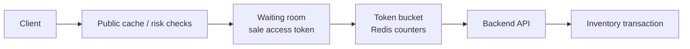
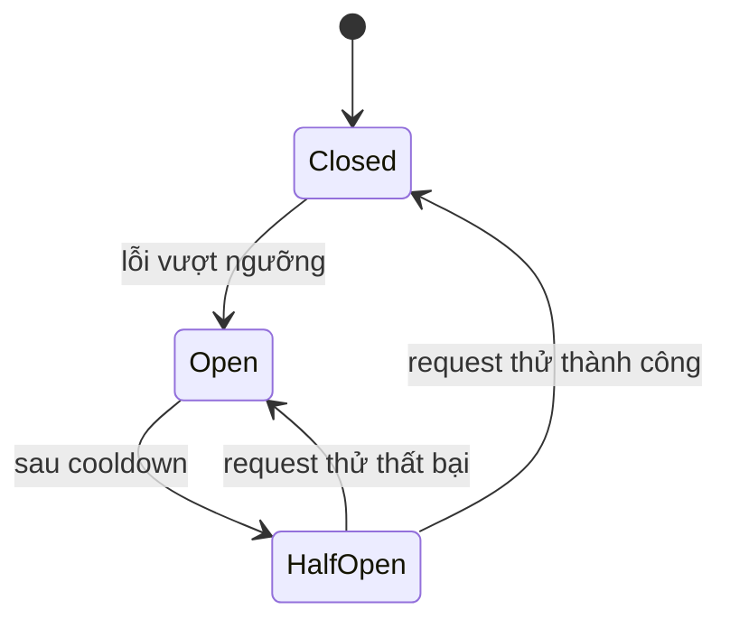
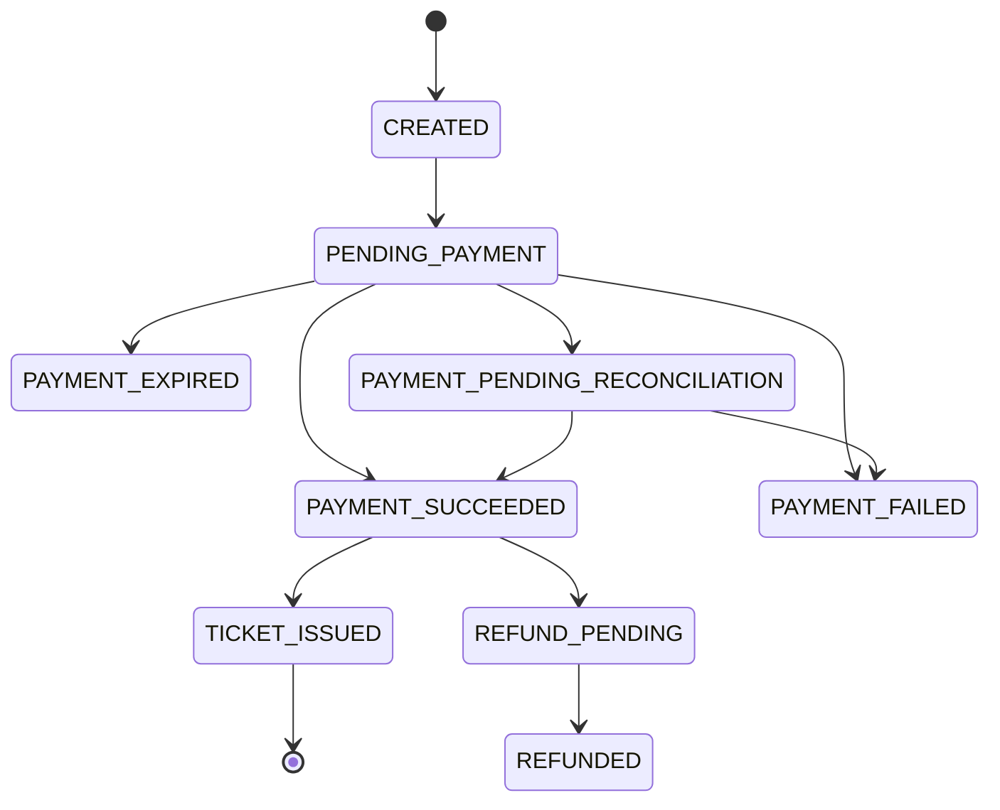
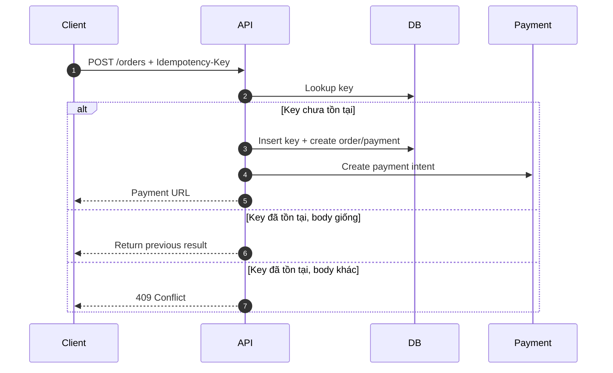
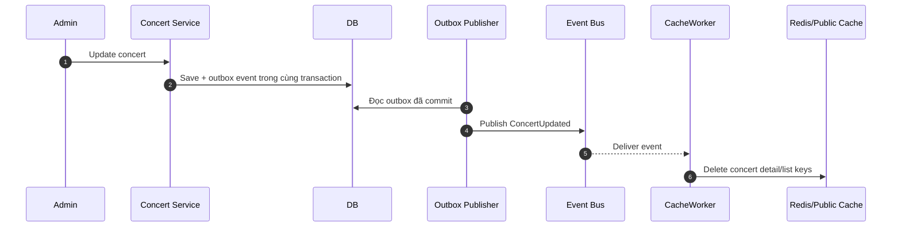
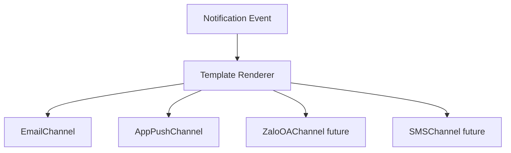
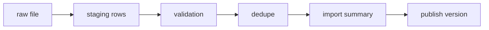

# 7. Thiết kế các cơ chế bảo vệ hệ thống

Tài liệu này tập trung vào các lớp bảo vệ ở biên hệ thống và quanh dependency: admission control, rate limiting, circuit breaker, idempotency, caching và policy xử lý lỗi.

Invariant dữ liệu, schema và transaction algorithm của inventory/quota được quản lý tại [04-database-design.md](04-database-design.md). Các lớp bảo vệ trong file này chỉ giảm tải và giảm request lỗi; chúng không thay thế transaction database.

## Bảo vệ đường ghi inventory và quota

Inventory Service và PostgreSQL vẫn là nơi quyết định request reserve có hợp lệ hay không. Các lớp bên ngoài bảo vệ đường ghi như sau:

| Lớp bảo vệ | Trách nhiệm | Không được làm |
|---|---|---|
| Waiting room | Giới hạn số người được tiếp cận luồng reserve cùng lúc. | Quyết định vé còn hay hết. |
| Rate limit | Chặn spam theo IP, user, device và endpoint. | Thay thế kiểm tra quota trong transaction. |
| Idempotency | Làm retry an toàn và trả lại kết quả cũ cho request trùng. | Bỏ qua validation inventory/quota. |
| Admission control/backpressure | Giữ write concurrency trong ngưỡng backend và database chịu được. | Xếp hàng vô hạn hoặc xác nhận reservation trước khi database commit. |

Chi tiết transaction giữ vé và quota ledger: [04-database-design.md](04-database-design.md#transaction-giữ-vé). Lý do và trade-off: [tranh chấp vé cuối cùng](core-design-decisions/last-ticket-contention.md) và [giới hạn vé mỗi tài khoản](core-design-decisions/per-user-ticket-limit.md).

## Kiểm soát tải đột biến

### Giải pháp

Kết hợp nhiều lớp:

1. Public cache cho trang public và static assets.
2. Waiting room/virtual queue trước giờ mở bán.
3. Rate limiting bằng token bucket ở Backend API/Redis.
4. Per-user/per-IP/per-device limit cho endpoint nóng như `/reservations`.
5. Bot detection bằng pattern request, CAPTCHA theo risk score.
6. Bounded admission ở backend để từ chối sớm khi connection pool, worker hoặc database gần bão hòa.

### Token bucket cho reservation

| Scope | Ví dụ limit | Mục đích |
|---|---:|---|
| IP | 60 request/phút | Chặn spam thô. |
| User | 5 reserve attempts/phút | Chặn bấm liên tục. |
| Device/session | 10 request/phút | Giảm multi-account cùng device. |
| Ticket type hot | N command/giây | Bảo vệ row inventory hot. |

Nếu vượt limit, API trả `429 Too Many Requests` kèm `Retry-After`. Nếu waiting room quá tải, user được giữ ở hàng đợi thay vì dồn request vào database.

### Waiting room và sale access token

- Waiting room chốt trước chính sách admission cho từng đợt bán: FIFO hoặc randomized admission.
- Sale access token được ký, có `user/session`, `concert_id`, scope endpoint, `issued_at`, `expires_at` và nonce; backend kiểm tra chữ ký, TTL, scope và chống replay.
- Token không chứng minh còn vé và không thay thế transaction inventory/quota.
- Khi Redis/waiting room không khả dụng, public read path tiếp tục phục vụ cache stale trong giới hạn. Reserve path fail-closed hoặc dùng emergency admission limit nhỏ tại Backend API; không fail-open toàn bộ traffic vào database.

### Backpressure và overload response

- Mỗi tầng có concurrency limit và queue depth tối đa theo capacity test.
- Request chưa được nhận vào xử lý bị từ chối sớm bằng `429` hoặc `503` kèm `Retry-After`; không giữ HTTP connection chờ vô hạn.
- Client retry bằng cùng idempotency key, exponential backoff có jitter và tôn trọng `Retry-After`.
- Nếu dùng RabbitMQ để serialize command cực nóng, API chỉ trả thành công sau khi reservation đã commit; enqueue không đồng nghĩa đã giữ được vé.

## Xử lý cổng thanh toán không ổn định

### Circuit breaker

| Trạng thái | Hành vi |
|---|---|
| Closed | Gọi payment gateway bình thường. |
| Open | Không gọi gateway; trả thông báo payment tạm gián đoạn hoặc chuyển order sang pending retry. |
| Half-Open | Cho một lượng nhỏ request thử để kiểm tra gateway hồi phục. |

Circuit breaker phải có timeout budget, failure threshold, cooldown và giới hạn số probe half-open theo từng provider/operation. Payment call dùng bulkhead riêng để connection/thread chờ gateway không chiếm tài nguyên của public read path.

### Retry policy

- Chỉ retry lỗi transient có khả năng an toàn như connection failure trước khi nhận response, `429` hoặc `5xx` theo contract provider.
- Retry có số lần tối đa, exponential backoff và jitter; không retry đồng thời ở gateway, service và worker nếu sẽ nhân số request.
- Khi không biết provider đã tạo hoặc trừ tiền hay chưa, không tạo payment intent mới. Chuyển payment sang `PAYMENT_PENDING_RECONCILIATION`.
- Lỗi validation, signature hoặc business rejection không retry tự động.

### Graceful degradation

- Trang danh sách/chi tiết concert vẫn phục vụ qua cache.
- Button thanh toán có thể bị tạm disable hoặc hiển thị trạng thái "thanh toán đang gián đoạn".
- Order/reservation không được confirm nếu chưa có webhook/payment proof hợp lệ.
- Reconciliation job kiểm tra các payment pending quá lâu.

### Payment state machine

Nguyên tắc:

- `order_id` và `payment_intent_id` là idempotency boundary.
- Webhook có thể đến nhiều lần, đến trễ hoặc đến trước redirect callback.
- Redirect callback từ browser chỉ dùng để cập nhật UX, không phải bằng chứng cuối cùng.
- Mọi webhook phải verify signature và lưu raw payload hash để audit.
- Reconciliation job xử lý order pending quá lâu bằng API/report của gateway.

## Chống trừ tiền hai lần

### Idempotency key

Client gửi `Idempotency-Key` khi tạo reservation/order/payment. Backend lưu key cùng user và request hash.

| Thuộc tính | Thiết kế |
|---|---|
| Sinh key | Client tạo UUID cho mỗi intent mua vé. |
| Scope | `(user_id, idempotency_key, endpoint)` |
| Lưu ở đâu | PostgreSQL cho order/payment, Redis cache ngắn để giảm query. |
| Retention | PostgreSQL giữ record ít nhất đến khi order/payment kết thúc và hết thời hạn reconciliation/audit; Redis chỉ là cache tăng tốc có TTL ngắn hơn. |
| Request trùng | Nếu body hash giống, trả lại kết quả cũ; nếu khác, trả `409 Conflict`. |

Record idempotency có trạng thái `PROCESSING`, `SUCCEEDED` hoặc `FAILED_FINAL`. Insert key và thay đổi nghiệp vụ đầu tiên phải nằm trong cùng transaction để hai request đồng thời không cùng thực thi. Request gặp key `PROCESSING` trả trạng thái đang xử lý hoặc kết quả sau khi hoàn tất, không khởi chạy side effect thứ hai.

Webhook cũng idempotent theo `provider_transaction_id` và `payload_hash`.
Ticket issuing retry không tạo vé trùng vì từng ticket được chống trùng bằng `UNIQUE(order_item_id, sequence_no)` và `UNIQUE(qr_token_hash)`.

Kết thúc payment không được xóa durable idempotency record ngay. Cleanup chỉ chạy theo retention policy sau khi không còn webhook, reconciliation hoặc dispute cần đối chiếu.

## Caching

### Chiến lược

Dùng cache-aside với Redis và public cache khi phù hợp. Database vẫn là nguồn dữ liệu đúng cuối cùng cho checkout; cache chỉ phục vụ đọc và hiển thị gần realtime.

| Dữ liệu | Cache | TTL/invalidation | Ghi chú |
|---|---|---|---|
| Static assets | Object storage/public cache | Long TTL + versioned filename | Ảnh, SVG seating map. |
| Concert list | Redis + public cache | 30s-5m, invalidate khi publish/update | Đọc rất nhiều, đổi ít. |
| Concert detail | Redis + public cache | 30s-5m, invalidate khi update | Không nhúng dữ liệu user. |
| Inventory summary | Redis | 1s-10s hoặc update theo event | Chỉ hiển thị gần đúng. |
| Admin dashboard | Redis/read model | 5s-60s | Không query OLTP liên tục. |

TTL nên có jitter để nhiều key không hết hạn cùng lúc. Dữ liệu public có thể dùng stale-while-revalidate/stale-if-error; dữ liệu user, order và payment không được dùng shared cache.

### Invalidation

Cache key cần có namespace/version và invalidation phải xóa cả detail, listing và key phụ thuộc. Khi payment thành công và vé được confirm, Inventory Service ghi outbox event để cập nhật inventory summary cache. Nếu event trễ, TTL ngắn giúp dữ liệu tự hồi phục.

Khi Redis/public cache lỗi, dùng request coalescing, concurrency limit và query budget cho fallback database. Nếu primary gần bão hòa, ưu tiên trả stale public data hoặc `503` thay vì cho cache miss không giới hạn làm ảnh hưởng reservation/payment.

## Check-in offline conflict policy

Không có thiết kế offline nào có thể tuyệt đối ngăn một vé được quét ở hai thiết bị khác nhau trong cùng lúc nếu cả hai đều offline và không chia sẻ trạng thái. Hệ thống giảm rủi ro bằng manifest theo cổng/khu, local checked-in set, sync thường xuyên và backend làm nguồn quyết định cuối cùng.

| Tình huống | Xử lý |
|---|---|
| Một ticket scan hai lần trên cùng device offline | App chặn bằng local checked-in set. |
| Một ticket scan ở hai device khác nhau đều offline | Backend phát hiện conflict khi sync. Event sync trước được accepted, event sau bị conflict. |
| Ticket bị refund/revoked sau khi manifest đã tải | App cần sync revoke list khi online. Với offline hoàn toàn, rủi ro còn lại phải giảm bằng manifest TTL và quy trình vận hành. |
| Device mất trước khi sync | Local DB encrypted, queue durable. Nếu mất vật lý, chỉ có thể giảm rủi ro bằng sync thường xuyên và phân vùng cổng. |
| Guest list cập nhật đêm trước diễn | Manifest có version. App bắt buộc sync version mới trước ca làm. |

Mỗi `CheckInAttempt` có event id được tạo trước khi append local và trạng thái `pending`, `syncing`, `accepted`, `conflict` hoặc `rejected`. Backend ACK theo từng event trong batch. App chỉ xóa payload local sau khi ACK đã được persist; `conflict/rejected` được giữ cho đến khi nhân sự xác nhận đã xử lý. Batch timeout có thể gửi lại cả batch bằng cùng event id.

Nếu manifest hết TTL, sai checksum/chữ ký hoặc không đúng assignment event/gate/zone, app không được tiếp tục offline scan. Clock skew allowance và key rotation phải được định nghĩa trong manifest contract.

## Notification extensibility

Notification Service dùng adapter để thêm kênh mới mà không sửa Order/Payment/Concert Service.

Các service nghiệp vụ chỉ publish event như `TicketIssued`, `ConcertReminderDue`, `ConcertCanceled`. Notification Service chịu trách nhiệm template, channel adapter, retry, DLQ và delivery log.

## CSV import reliability

CSV import không được ghi trực tiếp vào bảng guest list đang dùng.

Validation cần kiểm tra required fields, format email/phone, duplicate trong file, duplicate với guest list version hiện tại, zone/ticket type tồn tại, encoding và delimiter. File lỗi bị quarantine và không làm hỏng dữ liệu đang dùng tại cổng VIP.

Mặc định một batch publish theo chính sách all-or-nothing: có validation error thì không tạo version active mới. Batch idempotent theo `(concert_id, file_checksum, schema_version)`. Publish guest list version và ghi outbox `GuestListUpdated` trong cùng transaction để scanner không bỏ lỡ manifest update. File upload còn phải qua size limit, malware scan và vô hiệu hóa CSV formula khi xuất error report.

## AI Artist Bio safety

- PDF upload có size limit và malware scan.
- Extract text trước, loại bỏ dữ liệu không liên quan.
- Prompt yêu cầu bio ngắn, trung lập, không thêm thông tin không có trong tài liệu.
- Lưu prompt version và model version.
- Admin review/edit/publish, không auto-publish nếu chưa có chính sách kiểm duyệt.
- Nếu AI lỗi, concert vẫn hiển thị bình thường với bio thủ công hoặc placeholder.
- Mỗi job/stage idempotent theo object version và pipeline version; retry không tạo thêm draft.
- Timeout và retry budget dùng exponential backoff có jitter; lỗi parse/file policy không retry, lỗi model transient có thể retry.
- Vượt retry budget thì đưa job vào DLQ/failed state để admin retry thủ công sau khi sửa nguyên nhân.
- Chỉ gọi model sau khi extraction/sanitization thành công; nội dung PDF được xem là dữ liệu không tin cậy, không được phép thay đổi system instruction.
- File, extracted text, prompt và output có retention/access policy; job lỗi không thay bio đang publish.

## Policy chung cho worker và queue

RabbitMQ cung cấp delivery at-least-once, vì vậy mọi consumer phải idempotent. Notification, cache invalidation, reconciliation, CSV và AI dùng cùng nguyên tắc:

| Thành phần | Policy |
|---|---|
| Retry | Có giới hạn, exponential backoff + jitter, chỉ cho lỗi retryable. |
| DLQ | Message vượt retry budget vào DLQ; không tự động replay vô hạn. |
| ACK | Chỉ ACK sau khi side effect bền vững đã commit hoặc dedupe record đã lưu. |
| Poison message | Lỗi schema/validation vào DLQ ngay cùng error reason. |
| Replay | Công cụ/manual action phải giữ message id và idempotency key cũ. |

## Quan sát hệ thống và graceful degradation

Các dashboard/alert tối thiểu gồm:

- Waiting room admission rate, token rejection/replay, rate-limit rejection và overload `429/503`.
- Circuit state, timeout rate, pending reconciliation age và provider error rate.
- Cache hit ratio, stale response, fallback concurrency và database saturation.
- Queue depth, oldest message age, retry count và DLQ count theo worker.
- Unsynced check-in count/age, conflict rate và manifest version distribution.
- CSV batch failure/quarantine và AI job latency/failure.

Log và metrics dùng correlation id phù hợp như `order_id`, `payment_id`, `ticket_id`, `check_in_event_id`, `import_batch_id` và `artist_bio_job_id`, nhưng không ghi raw payment secret, QR token hoặc PII không cần thiết.
