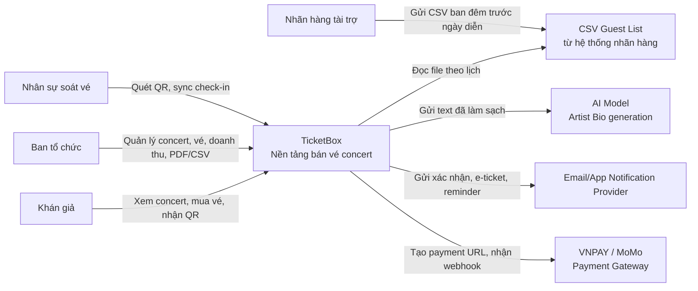
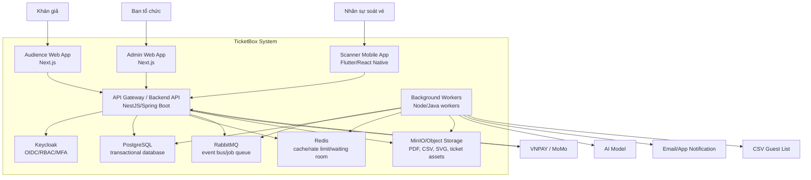

# 2. C4 Diagram

## Level 1 - System Context

### Diễn giải

TicketBox là hệ thống trung tâm. Khán giả, ban tổ chức và nhân sự soát vé tương tác trực tiếp với TicketBox. Các hệ thống ngoài gồm payment gateway, notification provider, AI model và nguồn CSV guest list. Tích hợp payment cần đồng bộ và có webhook; AI và CSV là luồng bất đồng bộ; notification không được ảnh hưởng đến kết quả mua vé.

## Level 2 - Container

### Công nghệ đề xuất

| Container | Công nghệ | Giao tiếp chính |
|---|---|---|
| Audience/Admin Web | Next.js | HTTPS tới API Gateway, cache public page ở edge. |
| Scanner Mobile App | Flutter hoặc React Native | HTTPS khi online, local encrypted DB khi offline. |
| Backend API | NestJS hoặc Spring Boot | REST, transaction PostgreSQL, Redis, RabbitMQ. |
| Workers | Cùng stack backend | RabbitMQ consumer, gọi AI/email/CSV/object storage. |
| PostgreSQL | SQL database | Transaction, constraint, index, lock cho consistency. |
| Redis | In-memory data store | Cache-aside, token bucket, waiting room token. |
| RabbitMQ | Message broker | Retry, DLQ, asynchronous workflow. |
| MinIO | Object storage | Lưu file lớn và asset versioned. |
| Keycloak | OIDC provider | Login, JWT/session, role, MFA. |

