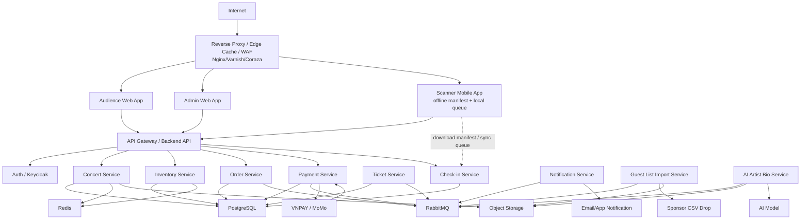

# 3. High-Level Architecture Diagram

## Sơ đồ tổng quan

## Các điểm tích hợp quan trọng

| Tích hợp | Luồng | Yêu cầu thiết kế |
|---|---|---|
| VNPAY/MoMo | Payment Service tạo payment intent/URL, gateway gửi webhook/callback. | Verify signature, idempotency key, payment state machine, reconciliation khi timeout. |
| AI model | AI Artist Bio Service gửi text đã clean để sinh bio ngắn. | Async job, retry/backoff, lưu draft, admin review trước publish. |
| CSV guest list | Import service đọc file CSV theo lịch từ object storage/drop folder. | Staging, validate, dedupe, publish version mới khi batch hợp lệ. |
| Scanner offline | Mobile app tải signed manifest, ghi local queue, sync lại khi online. | QR signed token, local durable storage, idempotent sync, conflict policy. |

## Luồng phụ thuộc khi checkout

Checkout phụ thuộc vào Auth, Inventory, Order, Payment và database transaction. Notification, analytics và email chỉ chạy sau qua queue. Nếu notification lỗi, checkout không rollback. Nếu payment gateway lỗi, hệ thống dừng bước thanh toán nhưng vẫn giữ được read path cho concert.

