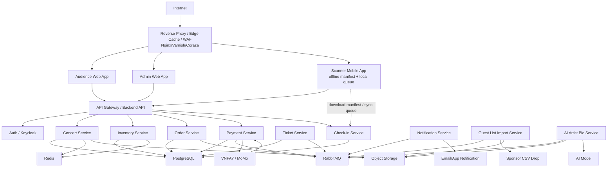
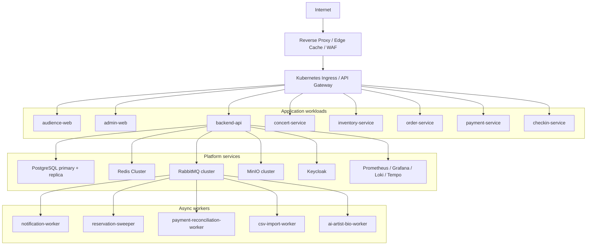

# 3. High-Level Architecture Diagram

Mục tiêu của phần này là mô tả dependency chi tiết giữa domain service, critical path, điểm tích hợp và topology triển khai. Actor, system context và container logic cấp cao được quản lý tại [02-c4-diagrams.md](02-c4-diagrams.md).

## Sơ đồ tổng quan

## Các điểm tích hợp quan trọng

| Tích hợp | Luồng | Yêu cầu thiết kế |
|---|---|---|
| VNPAY/MoMo | Payment Service tạo payment intent/URL, gateway gửi webhook/callback. | Verify signature, idempotency key, payment state machine, reconciliation khi timeout. |
| AI model | AI Artist Bio Service gửi text đã clean để sinh bio ngắn. | Async job, retry/backoff, lưu draft, admin review trước publish. |
| CSV guest list | Import service đọc file CSV theo lịch từ object storage/drop folder. | Staging, validate, dedupe, publish version mới khi batch hợp lệ. |
| Scanner offline | Mobile app tải signed manifest, ghi local queue, sync lại khi online. | QR signed token, local durable storage, idempotent sync, conflict policy. |

## Luồng phụ thuộc khi checkout

Checkout phụ thuộc vào Auth, Inventory, Order, Payment và database transaction. Notification, analytics và email chỉ chạy sau qua queue. Nếu notification lỗi, checkout không rollback. Nếu payment gateway lỗi, hệ thống dừng bước thanh toán nhưng vẫn giữ được read path cho concert.

## Topology triển khai khuyến nghị

| Layer | Khuyến nghị |
|---|---|
| Public edge | Nginx/HAProxy edge, Varnish hoặc Nginx cache cho static assets, WAF bằng ModSecurity/Coraza trước Kubernetes. |
| Kubernetes cluster | Tối thiểu 3 node worker production, tách node pool cho stateless app và stateful workload nếu tự host DB/broker trong cluster. |
| Database | PostgreSQL primary-replica, backup PITR, read replica cho dashboard/reporting. |
| Redis | Redis Cluster hoặc Redis Sentinel, memory sizing theo peak cache/rate-limit/waiting-room token. |
| RabbitMQ | 3-node cluster, durable queue, quorum queue cho event quan trọng, DLQ cho job lỗi. |
| Object storage | MinIO distributed mode, versioning cho PDF/CSV/seating map, lifecycle policy cho file tạm. |
| Observability | OpenTelemetry SDK trong backend, Prometheus scrape metrics, Loki collect logs, Tempo trace, Grafana dashboard. |
| CI/CD | Build image, scan vulnerabilities, push registry, deploy bằng Argo CD theo environment dev/staging/prod. |

## Trade-off chính

| Tiêu chí | Lợi ích | Rủi ro/chi phí | Cách giảm rủi ro |
|---|---|---|---|
| Kiểm soát hạ tầng | Chủ động cấu hình networking, data locality, version, scaling. | Team phải chịu trách nhiệm vận hành toàn bộ stack. | IaC/GitOps, runbook, staging giống production. |
| Chi phí | Có thể tối ưu nếu đã có server/cluster và traffic lớn. | Phải trả chi phí nền cho node, DB, broker kể cả khi ít traffic. | Autoscale stateless workload, capacity planning theo concert campaign. |
| Consistency | PostgreSQL transaction giúp reservation/payment dễ kiểm soát. | Hot row inventory có thể nghẽn dưới concurrent write lớn. | Waiting room, short transaction, row-level lock tối ưu, partition theo ticket type/concert. |
| Vận hành sự kiện | Có thể build dashboard và runbook sát nhu cầu vận hành. | Cần trực ca, alert, backup/restore, disaster recovery. | Sale-day checklist, game day test, load test, DR drill. |
