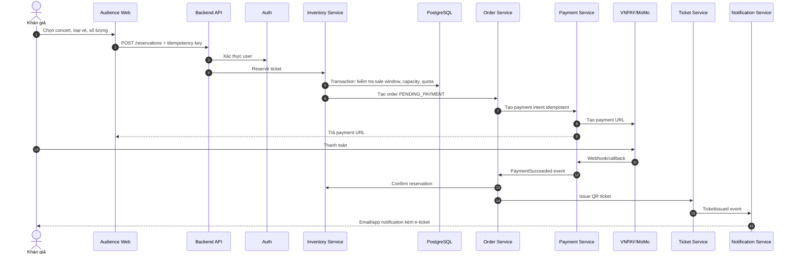
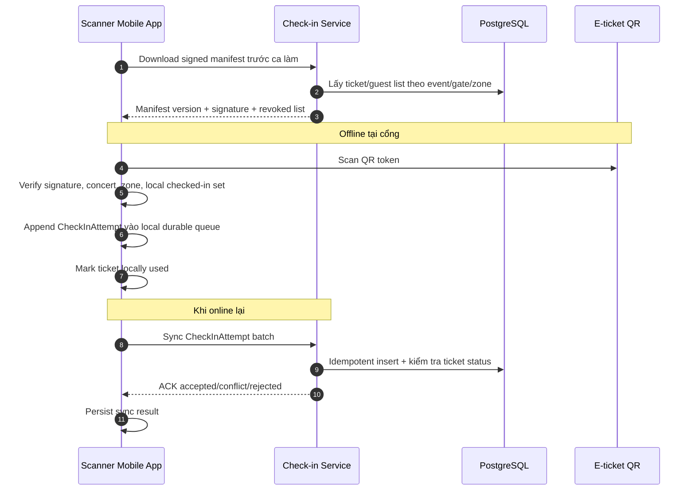
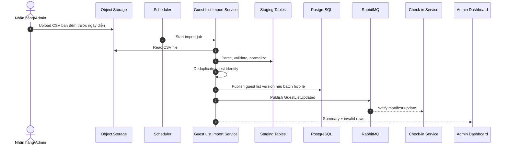
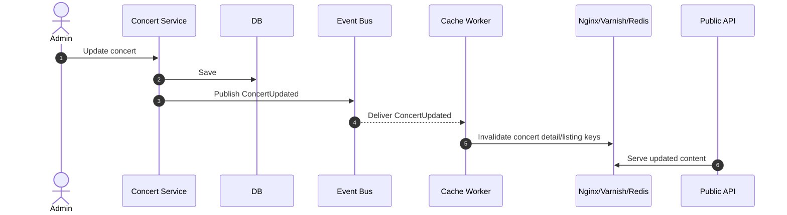
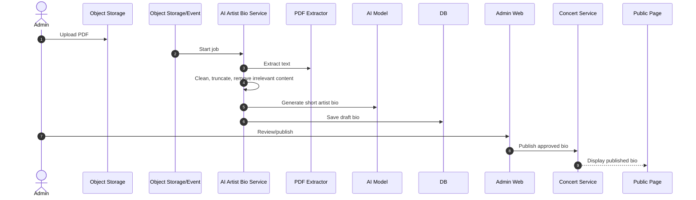

# 5. Mô tả các luồng nghiệp vụ quan trọng

Các luồng trong file này bao phủ các nghiệp vụ rủi ro nhất của TicketBox: mua vé, soát vé offline, nhập guest list CSV, cập nhật cache và AI Artist Bio.

## Luồng mua vé

### Xử lý lỗi giữa chừng

| Lỗi | Hành vi |
|---|---|
| User bấm mua nhiều lần | API kiểm tra idempotency key; request trùng trả lại kết quả cũ. |
| Hết vé khi reserve | Inventory transaction fail, không tạo order/payment. |
| User vượt quota | Lock/upsert `user_ticket_quotas`, reject nếu vượt limit. |
| Payment timeout | Order giữ `PENDING_PAYMENT`; reconciliation kiểm tra lại gateway; reservation hết TTL thì release. |
| Webhook gửi nhiều lần | Payment Service dedupe theo provider transaction id/payload hash. |
| Ticket issuing retry | Unique constraint theo `order_id` đảm bảo một order chỉ phát hành ticket một lần. |
| Notification lỗi | Ghi delivery failure và retry qua queue; không rollback ticket đã issued. |

## Luồng soát vé khi mất mạng và đồng bộ lại

### Xử lý lỗi giữa chừng

| Lỗi | Hành vi |
|---|---|
| Mất mạng hoàn toàn | App dùng signed manifest và local checked-in set. |
| App crash trước sync | Local queue durable/encrypted nên khởi động lại vẫn sync được. |
| Một vé scan hai lần cùng device | Local checked-in set chặn lần thứ hai. |
| Một vé scan ở hai device offline | Backend nhận sync trước thì accepted; sync sau conflict. |
| Manifest cũ | App bắt buộc refresh trước ca; manifest có version, TTL và revoked list. |

## Luồng nhập danh sách khách mời từ CSV

### Xử lý lỗi giữa chừng

| Lỗi | Hành vi |
|---|---|
| File không đọc được | Batch `FAILED`, giữ guest list version hiện tại. |
| Dòng thiếu field hoặc sai format | Ghi invalid row vào staging, hiển thị ở dashboard. |
| Trùng khách mời | Dedupe theo concert + identity + sponsor; không publish bản trùng. |
| Batch lỗi nặng | Quarantine file, không ghi đè dữ liệu production. |
| Import service restart | Job có idempotency theo file checksum/batch id. |

## Luồng cập nhật cache concert

### Xử lý lỗi giữa chừng

| Lỗi | Hành vi |
|---|---|
| Cache worker lỗi | TTL ngắn giúp cache tự hết hạn; worker retry event. |
| Event bus retry | Invalidation idempotent, xóa key nhiều lần vẫn an toàn. |
| Cache stampede | Dùng request coalescing, stale-while-revalidate và prewarm trước giờ mở bán. |

## Luồng AI Artist Bio

### Xử lý lỗi giữa chừng

| Lỗi | Hành vi |
|---|---|
| PDF lỗi hoặc quá lớn | Reject upload hoặc đưa job vào failed, không ảnh hưởng trang concert. |
| Extract text lỗi | Lưu lỗi job để admin upload lại hoặc nhập bio thủ công. |
| AI model timeout | Retry/backoff; nếu vẫn lỗi, giữ draft trống hoặc bio thủ công. |
| AI sinh nội dung không phù hợp | Không auto-publish; admin phải review/edit/publish. |
