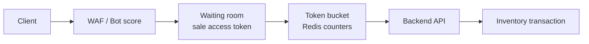
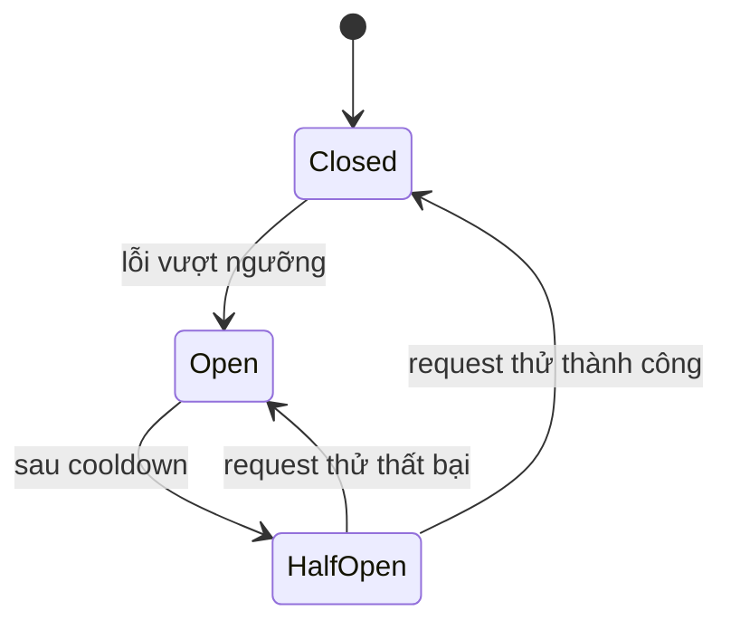
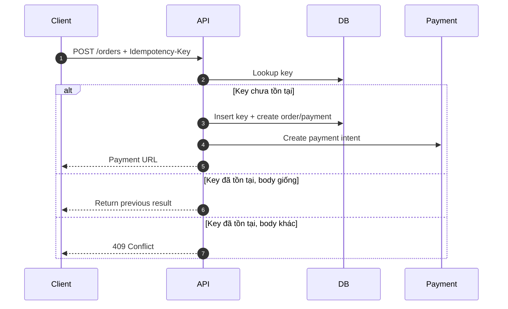
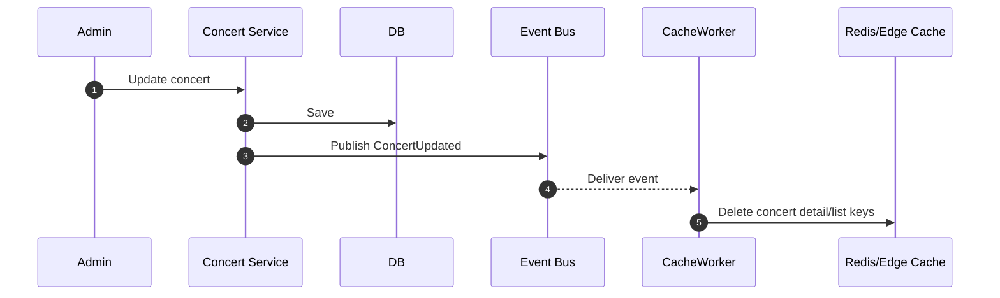

# 7. Thiết kế các cơ chế bảo vệ hệ thống

## Kiểm soát tải đột biến

### Giải pháp

Kết hợp nhiều lớp:

1. Edge cache cho trang public và static assets.
2. Waiting room/virtual queue trước giờ mở bán.
3. Rate limiting bằng token bucket ở API Gateway/Redis.
4. Per-user/per-IP/per-device limit cho endpoint nóng như `/reservations`.
5. Bot detection bằng pattern request, CAPTCHA theo risk score.

### Token bucket cho reservation

| Scope | Ví dụ limit | Mục đích |
|---|---:|---|
| IP | 60 request/phút | Chặn spam thô. |
| User | 5 reserve attempts/phút | Chặn bấm liên tục. |
| Device/session | 10 request/phút | Giảm multi-account cùng device. |
| Ticket type hot | N command/giây | Bảo vệ row inventory hot. |

Nếu vượt limit, API trả `429 Too Many Requests` kèm `Retry-After`. Nếu waiting room quá tải, user được giữ ở hàng đợi thay vì dồn request vào database.

## Xử lý cổng thanh toán không ổn định

### Circuit breaker

| Trạng thái | Hành vi |
|---|---|
| Closed | Gọi payment gateway bình thường. |
| Open | Không gọi gateway; trả thông báo payment tạm gián đoạn hoặc chuyển order sang pending retry. |
| Half-Open | Cho một lượng nhỏ request thử để kiểm tra gateway hồi phục. |

### Graceful degradation

- Trang danh sách/chi tiết concert vẫn phục vụ qua cache.
- Button thanh toán có thể bị tạm disable hoặc hiển thị trạng thái "thanh toán đang gián đoạn".
- Order/reservation không được confirm nếu chưa có webhook/payment proof hợp lệ.
- Reconciliation job kiểm tra các payment pending quá lâu.

## Chống trừ tiền hai lần

### Idempotency key

Client gửi `Idempotency-Key` khi tạo reservation/order/payment. Backend lưu key cùng user và request hash.

| Thuộc tính | Thiết kế |
|---|---|
| Sinh key | Client tạo UUID cho mỗi intent mua vé. |
| Scope | `(user_id, idempotency_key, endpoint)` |
| Lưu ở đâu | PostgreSQL cho order/payment, Redis cache ngắn để giảm query. |
| TTL | Ít nhất bằng thời gian payment pending/reconciliation, ví dụ 24 giờ. |
| Request trùng | Nếu body hash giống, trả lại kết quả cũ; nếu khác, trả `409 Conflict`. |

Webhook cũng idempotent theo `provider_transaction_id` và `payload_hash`. Ticket issuing có unique constraint theo `order_id` để một order không sinh nhiều vé.

## Caching

### Chiến lược

Dùng cache-aside với Redis và reverse proxy cache. Database vẫn là nguồn dữ liệu đúng cuối cùng cho checkout; cache chỉ phục vụ đọc và hiển thị gần realtime.

| Dữ liệu | Cache | TTL/invalidation | Ghi chú |
|---|---|---|---|
| Static assets | Nginx/Varnish/Object Storage | Long TTL + versioned filename | Ảnh, SVG seating map. |
| Concert list | Redis + edge cache | 30s-5m, invalidate khi publish/update | Đọc rất nhiều, đổi ít. |
| Concert detail | Redis + edge cache | 30s-5m, invalidate khi update | Không nhúng dữ liệu user. |
| Inventory summary | Redis | 1s-10s hoặc update theo event | Chỉ hiển thị gần đúng. |
| Admin dashboard | Redis/read model | 5s-60s | Không query OLTP liên tục. |

### Invalidation

Khi payment thành công và vé được confirm, Inventory Service publish event để cập nhật inventory summary cache. Nếu event trễ, TTL ngắn giúp dữ liệu tự hồi phục.

