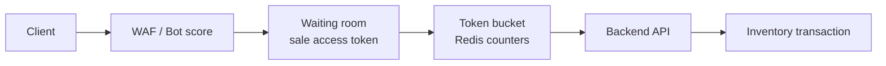
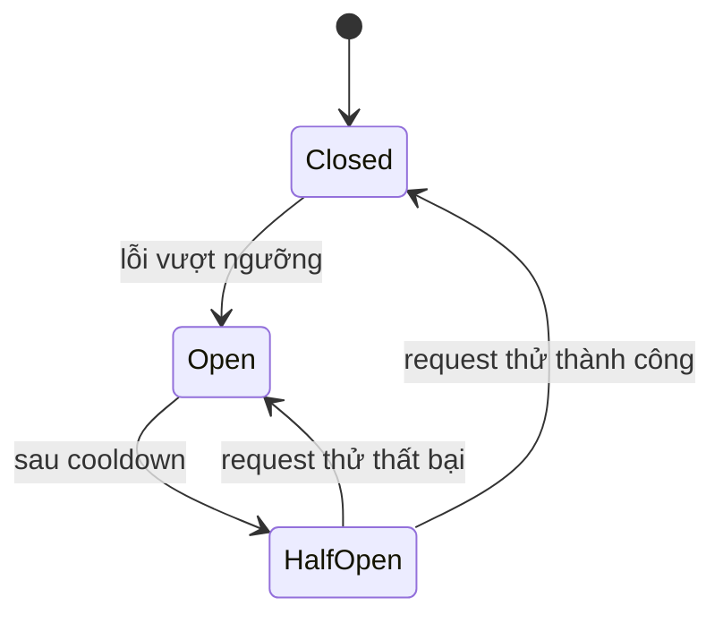
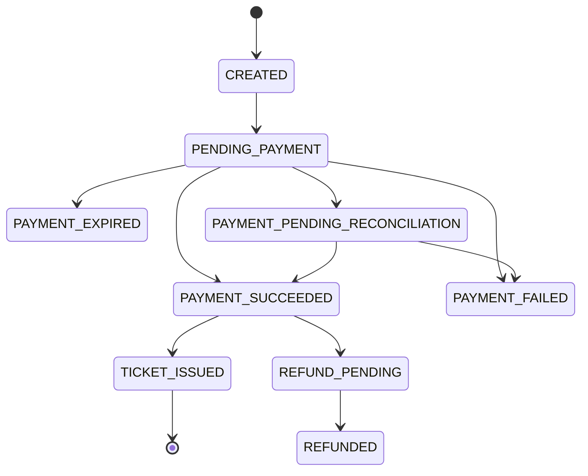
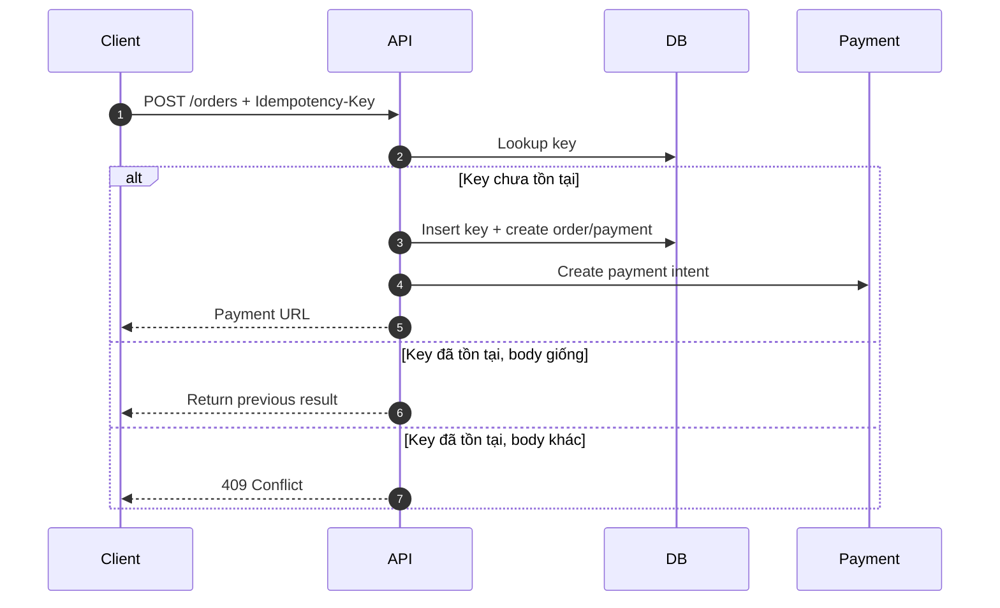
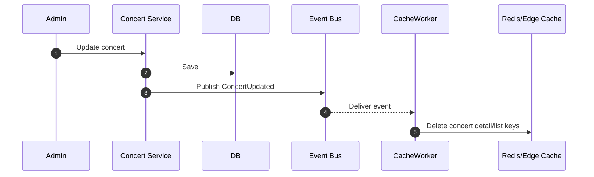
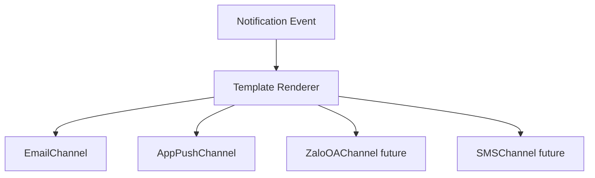
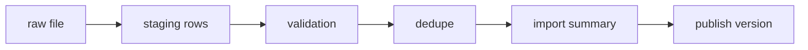

# 7. Thiết kế các cơ chế bảo vệ hệ thống

Ngoài rate limiting, circuit breaker, idempotency key và caching, blueprint bổ sung consistency cho inventory/quota vì đây là rủi ro cốt lõi nhất của TicketBox.

## Bảo vệ consistency inventory và quota

Inventory là nguồn quyết định bán vé, không phải cache. Mỗi request reserve phải đi qua transaction hoặc conditional write.

```text
sold_count + active_reserved_count <= total_capacity
paid_user_ticket_count <= configured_user_limit
one successful payment confirmation issues ticket exactly once
one ticket can have at most one accepted check-in
```

### Cách hoạt động

- Reservation có TTL và tự release khi payment fail/timeout.
- Transaction lock `ticket_inventory` và `user_ticket_quota` cùng lúc để chống oversell và chống vượt quota bằng request song song.
- `reserved_count` tăng khi reserve, chuyển sang `sold_count` khi payment success.
- Sweeper/reconciliation giải phóng reservation hết hạn.
- Với ticket type hot, waiting room giới hạn concurrency để tránh row lock quá nóng.

## Kiểm soát tải đột biến

### Giải pháp

Kết hợp nhiều lớp:

1. Edge cache cho trang public và static assets.
2. Waiting room/virtual queue trước giờ mở bán.
3. Rate limiting bằng token bucket ở API Gateway/Redis.
4. Per-user/per-IP/per-device limit cho endpoint nóng như `/reservations`.
5. Bot detection bằng pattern request, CAPTCHA theo risk score.

### Token bucket cho reservation

| Scope | Ví dụ limit | Mục đích |
|---|---:|---|
| IP | 60 request/phút | Chặn spam thô. |
| User | 5 reserve attempts/phút | Chặn bấm liên tục. |
| Device/session | 10 request/phút | Giảm multi-account cùng device. |
| Ticket type hot | N command/giây | Bảo vệ row inventory hot. |



Nếu vượt limit, API trả `429 Too Many Requests` kèm `Retry-After`. Nếu waiting room quá tải, user được giữ ở hàng đợi thay vì dồn request vào database.

## Xử lý cổng thanh toán không ổn định

### Circuit breaker



| Trạng thái | Hành vi |
|---|---|
| Closed | Gọi payment gateway bình thường. |
| Open | Không gọi gateway; trả thông báo payment tạm gián đoạn hoặc chuyển order sang pending retry. |
| Half-Open | Cho một lượng nhỏ request thử để kiểm tra gateway hồi phục. |

### Graceful degradation

- Trang danh sách/chi tiết concert vẫn phục vụ qua cache.
- Button thanh toán có thể bị tạm disable hoặc hiển thị trạng thái "thanh toán đang gián đoạn".
- Order/reservation không được confirm nếu chưa có webhook/payment proof hợp lệ.
- Reconciliation job kiểm tra các payment pending quá lâu.

### Payment state machine



Nguyên tắc:

- `order_id` và `payment_intent_id` là idempotency boundary.
- Webhook có thể đến nhiều lần, đến trễ hoặc đến trước redirect callback.
- Redirect callback từ browser chỉ dùng để cập nhật UX, không phải bằng chứng cuối cùng.
- Mọi webhook phải verify signature và lưu raw payload hash để audit.
- Reconciliation job xử lý order pending quá lâu bằng API/report của gateway.

## Chống trừ tiền hai lần

### Idempotency key

Client gửi `Idempotency-Key` khi tạo reservation/order/payment. Backend lưu key cùng user và request hash.

| Thuộc tính | Thiết kế |
|---|---|
| Sinh key | Client tạo UUID cho mỗi intent mua vé. |
| Scope | `(user_id, idempotency_key, endpoint)` |
| Lưu ở đâu | PostgreSQL cho order/payment, Redis cache ngắn để giảm query. |
| TTL | Ít nhất bằng thời gian payment pending/reconciliation, ví dụ 24 giờ. |
| Request trùng | Nếu body hash giống, trả lại kết quả cũ; nếu khác, trả `409 Conflict`. |



Webhook cũng idempotent theo `provider_transaction_id` và `payload_hash`. Ticket issuing có unique constraint theo `order_id` để một order không sinh nhiều vé.

## Caching

### Chiến lược

Dùng cache-aside với Redis và reverse proxy cache. Database vẫn là nguồn dữ liệu đúng cuối cùng cho checkout; cache chỉ phục vụ đọc và hiển thị gần realtime.

| Dữ liệu | Cache | TTL/invalidation | Ghi chú |
|---|---|---|---|
| Static assets | Nginx/Varnish/Object Storage | Long TTL + versioned filename | Ảnh, SVG seating map. |
| Concert list | Redis + edge cache | 30s-5m, invalidate khi publish/update | Đọc rất nhiều, đổi ít. |
| Concert detail | Redis + edge cache | 30s-5m, invalidate khi update | Không nhúng dữ liệu user. |
| Inventory summary | Redis | 1s-10s hoặc update theo event | Chỉ hiển thị gần đúng. |
| Admin dashboard | Redis/read model | 5s-60s | Không query OLTP liên tục. |

### Invalidation



Khi payment thành công và vé được confirm, Inventory Service publish event để cập nhật inventory summary cache. Nếu event trễ, TTL ngắn giúp dữ liệu tự hồi phục.

## Check-in offline conflict policy

Không có thiết kế offline nào có thể tuyệt đối ngăn một vé được quét ở hai thiết bị khác nhau trong cùng lúc nếu cả hai đều offline và không chia sẻ trạng thái. Hệ thống giảm rủi ro bằng manifest theo cổng/khu, local checked-in set, sync thường xuyên và backend làm nguồn quyết định cuối cùng.

| Tình huống | Xử lý |
|---|---|
| Một ticket scan hai lần trên cùng device offline | App chặn bằng local checked-in set. |
| Một ticket scan ở hai device khác nhau đều offline | Backend phát hiện conflict khi sync. Event sync trước được accepted, event sau bị conflict. |
| Ticket bị refund/revoked sau khi manifest đã tải | App cần sync revoke list khi online. Với offline hoàn toàn, rủi ro còn lại phải giảm bằng manifest TTL và quy trình vận hành. |
| Device mất trước khi sync | Local DB encrypted, queue durable. Nếu mất vật lý, chỉ có thể giảm rủi ro bằng sync thường xuyên và phân vùng cổng. |
| Guest list cập nhật đêm trước diễn | Manifest có version. App bắt buộc sync version mới trước ca làm. |

## Notification extensibility

Notification Service dùng adapter để thêm kênh mới mà không sửa Order/Payment/Concert Service.



Các service nghiệp vụ chỉ publish event như `TicketIssued`, `ConcertReminderDue`, `ConcertCanceled`. Notification Service chịu trách nhiệm template, channel adapter, retry, DLQ và delivery log.

## CSV import reliability

CSV import không được ghi trực tiếp vào bảng guest list đang dùng.



Validation cần kiểm tra required fields, format email/phone, duplicate trong file, duplicate với guest list version hiện tại, zone/ticket type tồn tại, encoding và delimiter. File lỗi bị quarantine và không làm hỏng dữ liệu đang dùng tại cổng VIP.

## AI Artist Bio safety

- PDF upload có size limit và malware scan.
- Extract text trước, loại bỏ dữ liệu không liên quan.
- Prompt yêu cầu bio ngắn, trung lập, không thêm thông tin không có trong tài liệu.
- Lưu prompt version và model version.
- Admin review/edit/publish, không auto-publish nếu chưa có chính sách kiểm duyệt.
- Nếu AI lỗi, concert vẫn hiển thị bình thường với bio thủ công hoặc placeholder.
