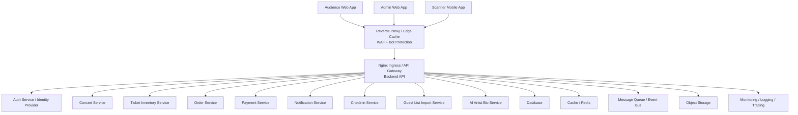

# TicketBox System Design

Tài liệu này thiết kế hệ thống TicketBox dựa trên bối cảnh trong [`project-brief-ticketbox.md`](../project-brief-ticketbox.md). Mục tiêu là tạo nền tảng kiến trúc đủ rõ để team backend/cloud có thể triển khai từng service, dữ liệu, luồng tích hợp và hạ tầng vận hành.

## Thiết kế tổng quan trước

TicketBox không nên được thiết kế như một website CRUD bán vé đơn giản. Điểm khó nằm ở các luồng có tính cạnh tranh cao: hàng chục nghìn người cùng mua một số lượng vé hữu hạn, giới hạn mua theo từng tài khoản phải đúng dưới concurrent request, payment gateway có thể timeout, và nhân sự soát vé vẫn phải check-in được trong khu vực mạng yếu.

Kiến trúc đề xuất là kiến trúc event-driven, service-oriented theo domain, triển khai theo hướng self-hosted/container-based trên Docker và Kubernetes. Các luồng đọc nhiều như danh sách concert, chi tiết concert, sơ đồ chỗ ngồi và số vé còn lại được phục vụ qua edge cache self-hosted, Redis và read model. Các luồng ghi quan trọng như giữ vé, tạo order, xác nhận thanh toán và check-in đi qua backend API có idempotency, transaction và event bus để đảm bảo tính nhất quán.

### High-level architecture

### Core design decisions

| Vấn đề | Quyết định thiết kế |
|---|---|
| Tranh chấp vé cuối cùng | Không trừ vé trực tiếp từ UI. Dùng flow `reserve -> pay -> confirm`, reservation có TTL, cập nhật inventory bằng conditional write hoặc transaction. |
| Giới hạn vé mỗi tài khoản | Enforce ở backend trong cùng transaction với reservation/order, không tin dữ liệu client. Dùng per-user ticket quota ledger. |
| Tải đọc cực cao | Cache mạnh tại Nginx/Varnish và Redis. Tách dữ liệu chi tiết concert tương đối tĩnh khỏi số lượng vé còn lại realtime/gần realtime. |
| Công bằng khi mở bán | Waiting room/virtual queue, rate limit, WAF, bot score, CAPTCHA theo rủi ro, token mở bán ngắn hạn. |
| Payment timeout | Idempotency key cho order/payment, payment state machine, webhook reconciliation, không tạo vé cho đến khi payment được xác nhận. |
| Check-in offline | Mobile app lưu local durable log, sync idempotent khi online. Với vé thường, ưu tiên preloaded signed ticket manifest theo cổng/khu. Với xung đột offline, backend là nguồn quyết định cuối cùng. |
| Guest list CSV | Import bất đồng bộ theo batch, staging table, validation, deduplication, quarantine file lỗi, không ghi thẳng vào production table. |
| AI Artist Bio | Upload PDF vào object storage, xử lý async bằng queue/workflow, extract text, sanitize, gọi AI model, human review nếu cần. |
