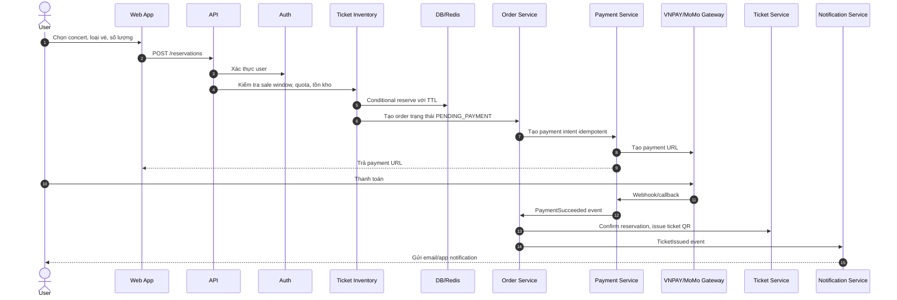
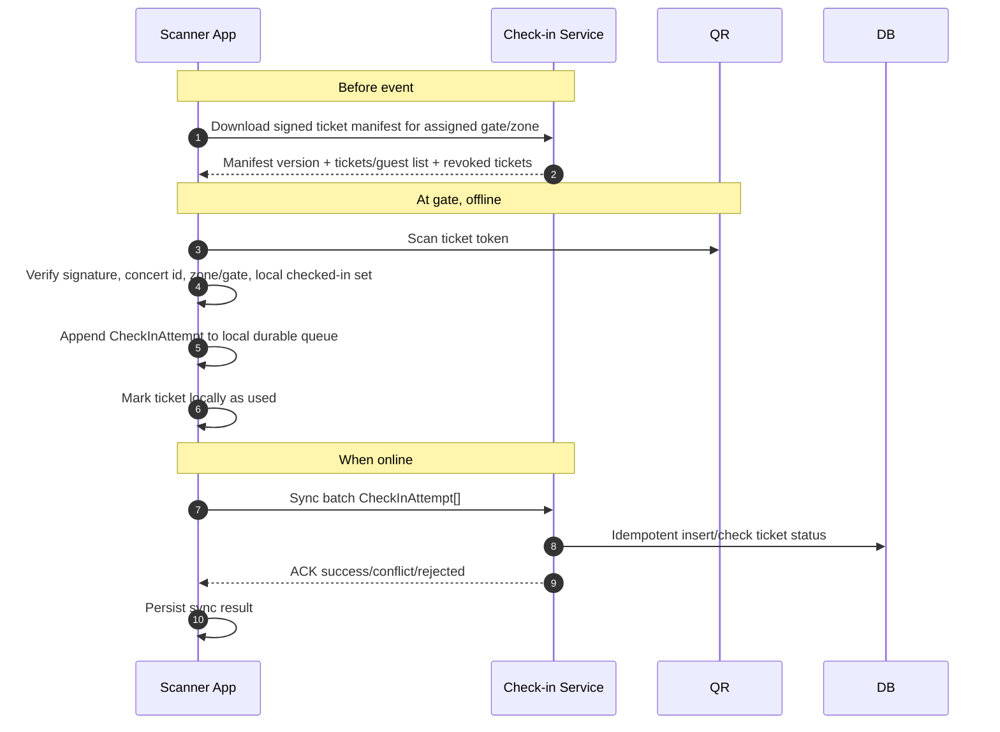

# 2. Functional Requirements

## 2.1 Khán giả

| Chức năng | Mô tả | Ghi chú thiết kế |
|---|---|---|
| Xem danh sách concert | Hiển thị concert sắp diễn ra, nghệ sĩ, địa điểm, thời gian, trạng thái mở bán. | Cache tại Nginx/Varnish/Redis, invalidation khi admin cập nhật. |
| Xem chi tiết concert | Hiển thị mô tả, artist bio, sơ đồ khu vực, loại vé, giá vé, thời điểm mở bán. | Tách nội dung tĩnh khỏi inventory động. |
| Xem sơ đồ chỗ ngồi/khu vực vé | SVG tương tác theo GA, SVIP, VIP, CAT1, CAT2. | SVG lưu MinIO/object storage và cache qua reverse proxy, metadata khu vé lấy từ API. |
| Xem số vé còn lại | Hiển thị số vé còn lại theo khu gần realtime. | Không yêu cầu tuyệt đối realtime từng vé, tránh tạo tải lớn. |
| Mua vé | Chọn loại vé, số lượng, submit order. | Backend kiểm tra quota, sale window, inventory, anti-bot token. |
| Thanh toán | Redirect/deeplink qua VNPAY/MoMo và nhận kết quả. | Idempotency, timeout handling, webhook reconciliation. |
| Nhận e-ticket QR | Sau payment thành công, hệ thống phát hành e-ticket có QR. | QR nên chứa signed token hoặc ticket id + signature, không chứa dữ liệu nhạy cảm thô. |
| Nhận thông báo | Email/app notification khi mua thành công và nhắc trước 24 giờ. | Gửi async qua notification event. |
| Xem lịch sử đơn/vé | Xem order, trạng thái thanh toán, QR ticket. | Hữu ích để xử lý payment pending và hỗ trợ khách hàng. |

### Flow mua vé của khán giả

## 2.2 Ban tổ chức

| Chức năng | Mô tả | Ghi chú thiết kế |
|---|---|---|
| Tạo concert | Nhập tên, mô tả, nghệ sĩ, địa điểm, thời gian, trạng thái publish. | Chỉ role organizer/admin. |
| Cấu hình loại vé | Tên vé, giá, số lượng, khu vực, thời điểm mở bán. | Sau khi mở bán cần hạn chế sửa số lượng/giá tùy policy. |
| Cấu hình giới hạn vé mỗi tài khoản | Ví dụ SVIP tối đa 2 vé/user, CAT1 tối đa 4 vé/user. | Enforce ở backend bằng quota ledger. |
| Cập nhật concert | Sửa thông tin, hình ảnh, sơ đồ, nội dung hiển thị. | Invalidate Nginx/Varnish/Redis cache sau thay đổi. |
| Hủy concert | Chuyển trạng thái canceled, dừng bán, trigger refund/notification flow. | Cần workflow riêng vì liên quan payment/refund. |
| Theo dõi doanh thu | Revenue theo concert, ticket type, payment status. | Không query trực tiếp bảng transaction lớn cho dashboard realtime. Dùng read model/analytics. |
| Theo dõi lượng vé bán ra | Sold/reserved/available theo loại vé. | Event-driven read model để dashboard nhẹ. |
| Upload PDF press kit | Upload PDF để tạo AI Artist Bio. | File vào object storage, xử lý async, admin xem lại nội dung sinh ra. |
| Quản lý guest list | Xem trạng thái import CSV, lỗi dòng, dữ liệu trùng. | Cần audit log vì liên quan quyền vào cổng. |

## 2.3 Nhân sự soát vé

| Chức năng | Mô tả | Ghi chú thiết kế |
|---|---|---|
| Đăng nhập app soát vé | Nhân sự dùng tài khoản role scanner. | Token ngắn hạn, có thể bind với device/event/gate. |
| Tải dữ liệu phục vụ offline | Tải manifest vé/guest list theo concert, khu vực hoặc cổng. | Có version, checksum, encrypted local storage. |
| Quét QR | Camera scan QR trên e-ticket. | QR cần kiểm tra chữ ký để phát hiện giả mạo ngay cả offline. |
| Xác minh vé | Kiểm tra ticket hợp lệ, đúng concert, đúng cổng/khu, chưa check-in trong local state. | Online thì hỏi backend; offline thì dùng local manifest. |
| Ghi nhận check-in offline | Lưu check-in event vào durable local queue. | Mỗi event có idempotency key/device id/timestamp. |
| Đồng bộ khi có mạng | Push batch event lên Check-in Service. | Backend xử lý idempotent, trả conflict nếu vé đã check-in. |
| Xem trạng thái sync | Biết bao nhiêu event chưa đồng bộ, event lỗi/conflict. | Quan trọng cho vận hành tại cổng. |

### Flow check-in offline

Lưu ý: Không có thiết kế offline nào có thể tuyệt đối ngăn một vé được quét ở hai thiết bị khác nhau trong cùng lúc nếu cả hai đều offline và không chia sẻ trạng thái. Cách giảm rủi ro là phân vùng cổng/khu, preload manifest theo gate, hạn chế một ticket chỉ hợp lệ ở một cổng/khu, sync thường xuyên, và dùng backend làm nguồn quyết định cuối cùng khi có conflict.

## 2.4 Hệ thống tích hợp

| Tích hợp | Chức năng | Ghi chú thiết kế |
|---|---|---|
| VNPAY/MoMo | Tạo payment intent, redirect/deeplink, nhận webhook/callback, reconcile trạng thái. | Webhook phải verify signature, idempotent, retry-safe. |
| Email/app notification | Gửi xác nhận mua vé, e-ticket, reminder trước 24 giờ, thông báo hủy concert. | Dùng event và adapter pattern để thêm Zalo OA/SMS sau này. |
| Import CSV guest list | Định kỳ đọc file CSV từ object storage hoặc SFTP/drop folder. | Validate, dedupe, staging, publish version mới khi batch hợp lệ. |
| PDF processing | Nhận PDF press kit, extract text, clean content. | Giới hạn file size, virus scan, async processing. |
| AI model | Sinh artist bio ngắn gọn từ text đã xử lý. | Có prompt template, guardrails, output review, retry/backoff. |
