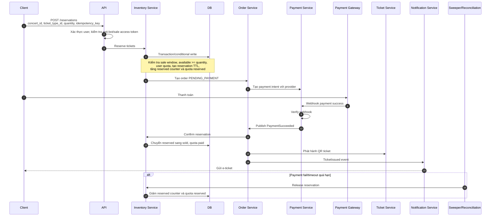
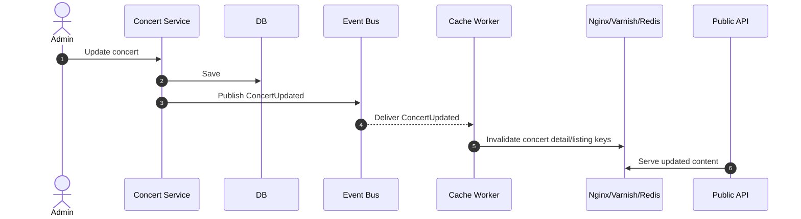
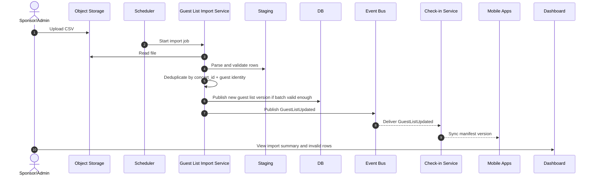
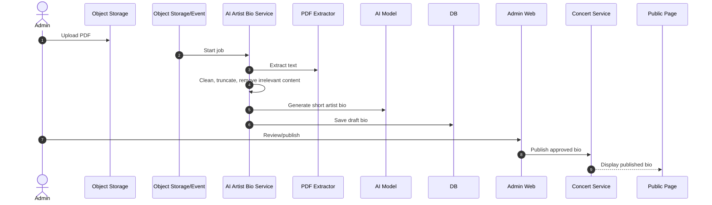

# 4. Đề xuất kiến trúc tổng thể

## Thành phần và nhiệm vụ

| Thành phần | Nhiệm vụ chính |
|---|---|
| Frontend Web App cho khán giả | Xem concert, sơ đồ vé, tạo reservation/order, thanh toán, xem e-ticket. Tối ưu cache, chống spam submit, hiển thị trạng thái payment pending rõ. |
| Admin Web App cho ban tổ chức | Quản lý concert, ticket type, quota, doanh thu, ticket sold, guest list import, PDF upload và AI artist bio. |
| Mobile App cho nhân sự soát vé | Quét QR, xác minh ticket, hỗ trợ offline manifest, lưu local check-in log, đồng bộ khi có mạng. |
| Nginx Ingress / API Gateway / Backend API | Entry point cho client, routing, authentication enforcement, throttling, request validation, correlation id. |
| Authentication & Authorization | Đăng ký/đăng nhập, token, session, MFA cho admin, RBAC/ABAC theo role và concert ownership. |
| Concert Service | Quản lý dữ liệu concert, artist, venue, seating map, publish/cancel status. Phát event khi có thay đổi để invalidate cache. |
| Ticket Inventory Service | Quản lý ticket type, capacity, sale window, reservation TTL, quota per-user, available count. Là service quan trọng nhất về consistency. |
| Order Service | Tạo và quản lý order lifecycle, liên kết reservation/payment/ticket issuance, đảm bảo idempotency. |
| Payment Service | Tích hợp VNPAY/MoMo, tạo payment intent, verify callback/webhook, reconcile, publish payment events. |
| Notification Service | Gửi email/app notification, reminder trước 24 giờ, thiết kế channel adapter để thêm Zalo OA/SMS. |
| Check-in Service | Quản lý ticket validation, check-in status, offline manifest, sync event, conflict resolution. |
| Guest List Import Service | Đọc CSV định kỳ, validate, dedupe, staging, publish guest list version mới, báo cáo lỗi. |
| AI Artist Bio Service | Xử lý PDF, extract text, clean, gọi AI model, lưu artist bio draft/published. |
| Database | Nguồn dữ liệu chính cho concert, order, payment, ticket, check-in, user role, guest list. |
| Cache | Nginx/Varnish/Redis cache cho concert read path, inventory summary, rate limit counter, queue token. |
| Message Queue / Event Bus | Giao tiếp bất đồng bộ giữa order/payment/ticket/notification/import/AI/analytics. |
| Object Storage | Lưu ảnh concert, SVG seating map, PDF press kit, CSV guest list, generated ticket PDF nếu cần. |
| Edge Cache / Static Asset Server | Phân phối frontend assets, ảnh, SVG, public concert content qua Nginx/Varnish/MinIO gateway, giảm tải backend. |
| Monitoring & Logging | Metrics, logs, traces, alert, dashboard vận hành sale và event day. |

## Service boundary đề xuất

| Domain | Owns data | Không nên làm |
|---|---|---|
| Concert Service | Concert, venue, artist bio, seating map metadata. | Không giữ logic bán vé/payment. |
| Inventory Service | Ticket type, capacity, reservations, quota ledger. | Không gọi payment gateway trực tiếp. |
| Order Service | Order state, order items, ticket issuance trigger. | Không tự tính inventory bằng cache. |
| Payment Service | Payment intent, provider transaction, webhook, reconciliation. | Không phát hành vé trực tiếp nếu chưa qua Order/Inventory contract. |
| Check-in Service | Ticket validation status, check-in event, scanner device, guest list projection. | Không sửa order/payment. |
| Notification Service | Notification job, template, delivery result. | Không chứa business state chính. |

## Dữ liệu chính

| Entity | Mục đích |
|---|---|
| `User` | Tài khoản audience/organizer/scanner. |
| `Organization` | Ban tổ chức hoặc đơn vị sở hữu concert. |
| `Concert` | Sự kiện, venue, thời gian, publish/cancel status. |
| `TicketType` | Loại vé, giá, tổng số lượng, sale window, quota limit. |
| `InventoryCounter` | Tổng capacity, reserved, sold, available theo ticket type. |
| `Reservation` | Vé giữ tạm, TTL, user, order, trạng thái. |
| `UserTicketQuota` | Số vé user đã reserved/paid theo concert/ticket type. |
| `Order` | Đơn hàng, trạng thái, tổng tiền, user. |
| `Payment` | Payment provider, transaction id, trạng thái, webhook payload hash. |
| `Ticket` | Vé đã phát hành, QR token/signature, owner, check-in status. |
| `CheckInEvent` | Lần quét vé, scanner id, device id, online/offline, sync status. |
| `GuestListBatch` | Batch import CSV, status, file, version, summary lỗi. |
| `GuestEntry` | Khách mời VIP sau validation. |
| `ArtistBioJob` | PDF processing job, extracted text, AI output, review status. |

## Luồng giữ vé và thanh toán

## Luồng cập nhật cache concert

## Luồng CSV guest list

## Luồng AI Artist Bio

