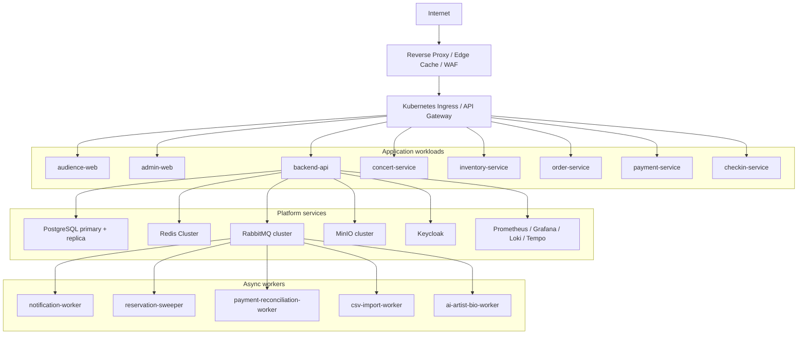

# 5. Công nghệ nên sử dụng

Tài liệu này chọn hướng self-hosted/container-based làm kiến trúc chính. Hệ thống chạy trên Docker và Kubernetes, dùng PostgreSQL làm nguồn dữ liệu chính, Redis cho cache/rate limit/waiting room, RabbitMQ hoặc Kafka cho xử lý bất đồng bộ, MinIO cho object storage, Keycloak cho identity, và OpenTelemetry stack cho observability.

## 5.1 Stack đề xuất

| Thành phần | Công nghệ đề xuất | Dùng để làm gì | Vì sao phù hợp | Nhược điểm | Phương án thay thế |
|---|---|---|---|---|---|
| Frontend Web App | React/Next.js | Web khán giả, trang danh sách concert, chi tiết concert, checkout, e-ticket. | Hỗ trợ SSR/SSG, routing tốt, tối ưu cache và SEO cho trang public. | Cần kiểm soát caching để không lẫn dữ liệu user/payment. | React SPA + Vite, Nuxt nếu dùng Vue. |
| Admin Web App | React/Next.js | Dashboard ban tổ chức, quản lý concert, upload PDF/CSV, báo cáo. | Có thể dùng chung design system và auth flow với web app. | Nếu gom chung repo với web audience cần tách quyền và route rõ. | React SPA, Angular. |
| Mobile Scanner App | Flutter hoặc React Native | App quét QR, offline manifest, local durable check-in log, sync. | Cross-platform, đủ tốt cho camera/QR/local DB. | Cần test kỹ camera, storage encryption và offline sync trên thiết bị thật. | Native iOS/Android nếu cần hiệu năng/thiết bị chuyên dụng. |
| Backend framework | NestJS hoặc Spring Boot | API backend, domain modules, workers, integration adapters. | NestJS hợp TypeScript/full-stack JS; Spring Boot mạnh về transaction và enterprise pattern. | NestJS cần discipline để không thành service quá lỏng; Spring Boot nặng hơn cho team nhỏ. | Fastify/Express, Go + Gin/Fiber. |
| Database | PostgreSQL | Concert, ticket type, reservation, order, payment, ticket, check-in, guest list, audit. | Transaction mạnh, lock/constraint rõ, query/reporting tốt, team dễ vận hành. | Hot row inventory có thể nghẽn nếu không có virtual queue và tối ưu transaction. | CockroachDB, MySQL, YugabyteDB. |
| Cache/session/rate limit | Redis Cluster | Concert cache, inventory summary, waiting room token, rate limit counter, distributed short-lived lock nếu cần. | Latency thấp, atomic counter tốt, dễ dùng cho flash-sale control. | Dữ liệu volatile, cần Sentinel/Cluster và eviction policy đúng. | KeyDB, Dragonfly, Hazelcast. |
| Message broker | RabbitMQ | Notification, ticket issuance, payment reconciliation, CSV import, AI jobs, DLQ. | Dễ vận hành hơn Kafka, routing/retry/DLQ phù hợp workflow nghiệp vụ. | Không tối ưu cho event analytics volume cực lớn. | Kafka nếu cần event streaming lớn, NATS nếu cần nhẹ và nhanh. |
| Event streaming optional | Kafka | Event log cho analytics, audit stream, real-time dashboard lớn. | Throughput cao, replay tốt. | Vận hành phức tạp, không nên đưa vào sớm nếu chưa cần. | Redpanda, Pulsar. |
| Container runtime | Docker | Đóng gói app, worker, job, local dev. | Chuẩn phổ biến, dễ CI/CD. | Image security và layer size cần kiểm soát. | Podman, containerd trực tiếp. |
| Orchestration | Kubernetes | Deploy service, autoscale, rollout, self-healing, config/secret orchestration. | Phù hợp hệ thống nhiều service/worker và traffic spike. | Chi phí vận hành cao, cần SRE/DevOps skill. | Docker Compose cho môi trường nhỏ, Nomad. |
| Ingress/API Gateway | Nginx Ingress Controller hoặc Kong Gateway | TLS termination, routing, auth plugin, rate limit, request size limit. | Kiểm soát tốt traffic vào backend, dễ triển khai trong Kubernetes. | Cần tuning worker/connection và config để chịu spike. | Traefik, HAProxy Ingress, Envoy Gateway. |
| WAF/Bot protection | ModSecurity/Coraza với OWASP CRS, kết hợp risk logic trong app | Chặn request độc hại, pattern bot cơ bản, request bất thường. | Self-hosted được, tích hợp reverse proxy. | Không đủ chống bot tinh vi nếu đứng một mình. | Nginx App Protect, HAProxy Enterprise WAF, custom risk engine. |
| Object storage | MinIO | Lưu ảnh concert, SVG seating map, PDF press kit, CSV guest list, ticket PDF/assets. | API object storage phổ biến, self-hosted, dễ chạy trong Kubernetes hoặc VM riêng. | Cần thiết kế backup/replication/lifecycle. | Ceph Object Gateway, SeaweedFS. |
| Identity Provider | Keycloak | OIDC/OAuth2, login, role, MFA, admin/scanner/audience realm hoặc client. | Self-hosted, chuẩn mở, RBAC tốt. | Cần vận hành DB/session/upgrade cẩn thận. | Ory Hydra/Kratos, Authelia. |
| Secrets | HashiCorp Vault hoặc Sealed Secrets | Lưu payment secret, DB credential, AI API key, JWT signing key. | Tránh hardcode secret, hỗ trợ rotation/audit tốt. | Vault cần vận hành unseal/HA; Sealed Secrets đơn giản hơn nhưng ít dynamic feature. | External Secrets Operator với secret backend nội bộ. |
| Monitoring | Prometheus + Grafana | Metrics, alert, dashboard sale day/event day. | Chuẩn Kubernetes, hệ sinh thái exporter phong phú. | Cardinality cao có thể làm Prometheus nặng. | VictoriaMetrics, Thanos. |
| Logging | Loki hoặc OpenSearch | Centralized logs, tìm lỗi theo order_id/payment_id/ticket_id. | Loki nhẹ và hợp Grafana; OpenSearch query mạnh hơn. | Loki query phức tạp kém hơn; OpenSearch tốn tài nguyên hơn. | ELK, Graylog. |
| Tracing | OpenTelemetry + Tempo/Jaeger | Distributed trace qua API, service, broker, DB. | Chuẩn mở, tránh lock-in, debug tốt luồng payment/order. | Cần instrument code nghiêm túc, sampling hợp lý. | Zipkin. |
| CI/CD | GitHub Actions/GitLab CI + Argo CD | Build image, scan, deploy GitOps vào Kubernetes. | GitOps dễ audit/rollback, hợp multi-env. | Cần quản lý secret và promotion flow rõ. | Jenkins, Tekton, Flux CD. |
| PDF parser/OCR | Apache PDFBox/PyMuPDF, Tesseract khi cần OCR | Extract text từ PDF press kit. | Self-hosted, chi phí thấp, kiểm soát dữ liệu. | OCR chất lượng thấp hơn dịch vụ chuyên dụng. | EasyOCR, PaddleOCR. |
| AI model integration | Self-hosted Llama/vLLM hoặc Ollama nội bộ | Tạo AI Artist Bio từ text đã làm sạch. | Kiểm soát dữ liệu tốt, phù hợp hướng self-hosted. | Cần GPU nếu muốn latency tốt; chất lượng model cần benchmark. | llama.cpp cho tải nhỏ, dịch vụ AI nội bộ do tổ chức vận hành. |
| Email/App notification | Postal/Mailu/SMTP nội bộ, in-app notification store | Gửi e-ticket, reminder, thông báo hủy trong app/web. | Phù hợp self-hosted, kiểm soát template và delivery log. | Self-host email khó deliverability; native mobile push vẫn phụ thuộc hạ tầng Apple/Google nếu cần push thật. | Haraka, OpenSMTPD, notification center trong backend. |

## 5.2 Kiến trúc container-based đề xuất

## 5.3 Topology triển khai

| Layer | Khuyến nghị |
|---|---|
| Public edge | Nginx/HAProxy edge, Varnish hoặc Nginx cache cho static assets, WAF bằng ModSecurity/Coraza trước Kubernetes. |
| Kubernetes cluster | Tối thiểu 3 node worker production, tách node pool cho stateless app và stateful workload nếu tự host DB/broker trong cluster. |
| Database | PostgreSQL primary-replica, backup PITR, read replica cho dashboard/reporting. Với production nghiêm túc, có thể chạy PostgreSQL trên VM/bare metal riêng để giảm rủi ro stateful workload trong Kubernetes. |
| Redis | Redis Cluster hoặc Redis Sentinel, memory sizing theo peak cache/rate-limit/waiting-room token. |
| RabbitMQ | 3-node cluster, durable queue, quorum queue cho event quan trọng, DLQ cho job lỗi. |
| Object storage | MinIO distributed mode, versioning cho PDF/CSV/seating map, lifecycle policy cho file tạm. |
| Observability | OpenTelemetry SDK trong backend, Prometheus scrape metrics, Loki collect logs, Tempo trace, Grafana dashboard. |
| CI/CD | Build image, scan vulnerabilities, push registry, deploy bằng Argo CD theo environment dev/staging/prod. |

## 5.4 Modular monolith hay microservices?

Khuyến nghị bắt đầu bằng modular monolith backend có module boundary rõ, kết hợp worker tách riêng cho tác vụ async. Khi traffic hoặc team size tăng, tách các module nóng thành service độc lập.

| Hướng | Ưu điểm | Nhược điểm | Khi nên dùng |
|---|---|---|---|
| Modular monolith | Transaction đơn giản hơn, dev nhanh, deploy ít phức tạp, dễ debug. | Scale theo toàn app, boundary dễ bị phá nếu thiếu discipline. | Giai đoạn đầu/MVP, team nhỏ, domain còn thay đổi. |
| Microservices đầy đủ | Scale độc lập, team ownership rõ, fault isolation tốt hơn. | Distributed transaction, observability, CI/CD, versioning phức tạp hơn. | Khi đã có tải lớn, nhiều team, module Inventory/Payment/Check-in cần scale độc lập. |
| Hybrid | API chính là modular monolith, worker và hot path tách dần. | Cần quản lý contract giữa module/service. | Phù hợp nhất cho TicketBox: giảm rủi ro ban đầu nhưng vẫn có đường mở rộng. |

## 5.5 Khuyến nghị lựa chọn cụ thể

Với TicketBox, stack thực tế nên bắt đầu như sau:

| Nhóm | Lựa chọn cụ thể |
|---|---|
| Frontend | Next.js cho audience web và admin web. |
| Backend | NestJS modular monolith, tách worker process cho notification, import, AI, reconciliation. Nếu team mạnh Java, Spring Boot là lựa chọn tương đương. |
| Database | PostgreSQL với transaction chặt cho reservation/order/payment/ticket/check-in. |
| Cache | Redis Cluster cho cache public page, inventory summary, rate limit và waiting room. |
| Broker | RabbitMQ cho domain event và background job; chỉ dùng Kafka khi có nhu cầu analytics/event replay lớn. |
| Object storage | MinIO cho PDF, CSV, ảnh, SVG seating map và ticket assets. |
| Auth | Keycloak OIDC, MFA cho admin, role audience/organizer/scanner. |
| Runtime | Docker + Kubernetes + Nginx Ingress/Kong. |
| Observability | Prometheus, Grafana, Loki, Tempo, OpenTelemetry. |
| Secrets | Vault nếu cần rotation/audit mạnh; Sealed Secrets nếu muốn đơn giản ở giai đoạn đầu. |

## 5.6 Trade-off của hướng self-hosted/container-based

| Tiêu chí | Lợi ích | Rủi ro/chi phí | Cách giảm rủi ro |
|---|---|---|---|
| Kiểm soát hạ tầng | Chủ động cấu hình networking, data locality, version, scaling. | Team phải chịu trách nhiệm vận hành toàn bộ stack. | IaC/GitOps, runbook, staging giống production. |
| Chi phí | Có thể tối ưu nếu đã có server/cluster và traffic lớn. | Phải trả chi phí nền cho node, DB, broker kể cả khi ít traffic. | Autoscale stateless workload, capacity planning theo concert campaign. |
| Chống lock-in | Dùng công nghệ OSS, dễ chuyển môi trường. | Tự tích hợp nhiều mảnh ghép hơn. | Chuẩn hóa qua OIDC, OpenTelemetry, SQL, container image. |
| Hiệu năng | Service luôn warm, latency ổn định hơn. | Nếu scale chậm, spike có thể làm nghẽn node/DB/broker. | Pre-scale trước giờ mở bán, virtual queue, rate limit ở ingress. |
| Consistency | PostgreSQL transaction giúp reservation/payment dễ kiểm soát. | Hot row inventory có thể nghẽn dưới concurrent write lớn. | Waiting room, short transaction, row-level lock tối ưu, partition theo ticket type/concert. |
| Vận hành sự kiện | Có thể build dashboard và runbook sát nhu cầu vận hành. | Cần trực ca, alert, backup/restore, disaster recovery. | Sale-day checklist, game day test, load test, DR drill. |
