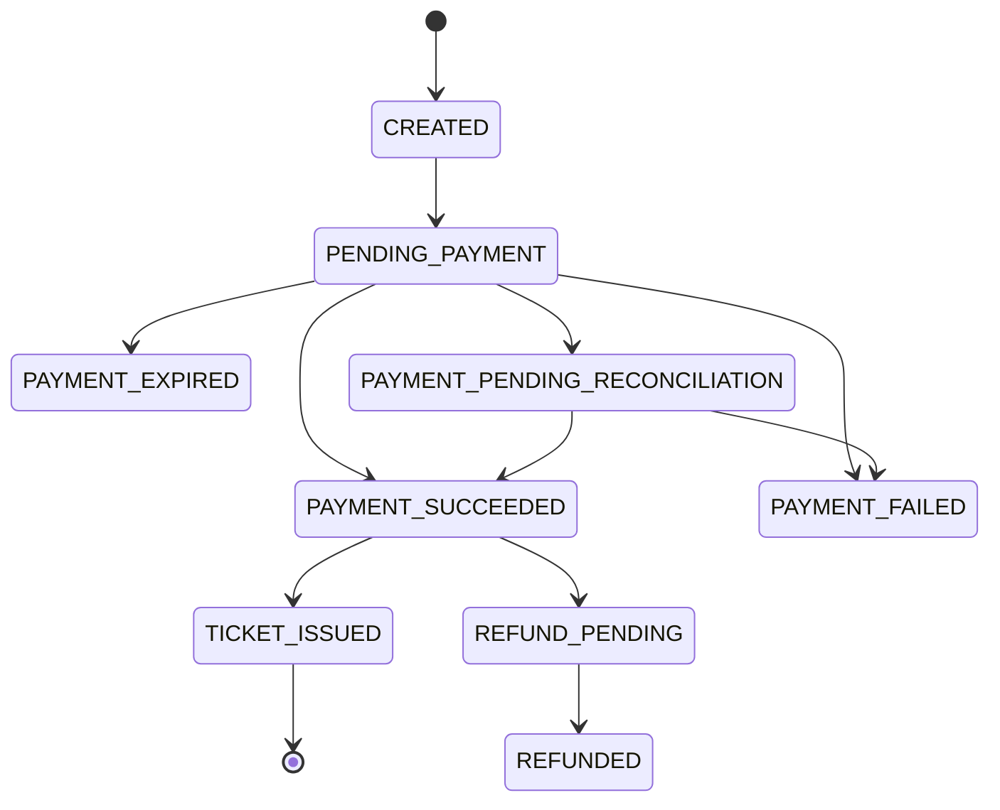
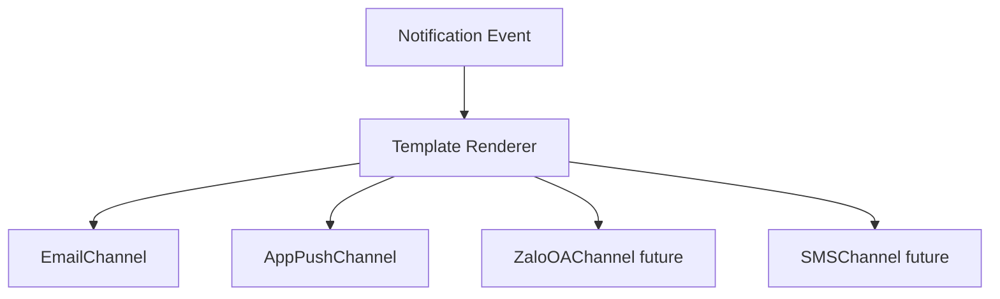
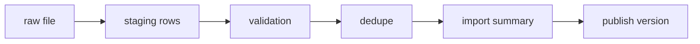

# 6. Thiết kế chi tiết các điểm rủi ro

## 6.1 Ticket inventory và reservation

Inventory là phần cần consistency cao nhất. Không nên dựa vào cache để quyết định bán vé.

### Invariant bắt buộc

```text
sold_count + active_reserved_count <= total_capacity
paid_user_ticket_count <= configured_user_limit
one successful payment confirmation issues ticket exactly once
one ticket can have at most one accepted check-in
```

### Cách triển khai với PostgreSQL

- Bảng `ticket_inventory` có `total_capacity`, `sold_count`, `reserved_count`, `version`.
- Tạo reservation trong transaction:
  - Lock row `ticket_inventory` bằng `SELECT ... FOR UPDATE`, hoặc dùng optimistic update `WHERE available >= quantity`.
  - Lock/upsert row `user_ticket_quota`.
  - Insert reservation TTL.
  - Update `reserved_count` và quota reserved.
- Sweeper chạy định kỳ release reservation hết hạn.
- Payment success chuyển reservation sang sold trong transaction.

Ưu điểm: dễ hiểu, transaction mạnh. Nhược điểm: row lock trên ticket type hot như SVIP có thể thành bottleneck. Cần virtual queue để giảm write concurrency vào hot row.

### Cách mở rộng khi PostgreSQL thành bottleneck

- Giữ transaction ngắn, chỉ lock đúng row `ticket_inventory` và `user_ticket_quota` cần thiết.
- Tách ticket type hot như SVIP thành queue riêng trong waiting room để giới hạn write concurrency.
- Partition/shard inventory theo `concert_id` và `ticket_type_id` nếu số lượng concert lớn.
- Dùng read replica cho dashboard/reporting, không để query báo cáo đụng vào primary trong giờ mở bán.
- Dùng RabbitMQ để serialize một số command cực hot nếu row lock gây retry quá nhiều, ví dụ một consumer xử lý reservation theo từng `ticket_type_id`.
- Với tải cực lớn, có thể tách Inventory Service sang database riêng hoặc dùng PostgreSQL cluster chuyên cho inventory.

Trade-off: serialize reservation theo ticket type giúp không oversell và giảm lock contention, nhưng phải kiểm soát queue latency để người dùng không chờ quá lâu.

## 6.2 Payment state machine



Nguyên tắc:

- `order_id` và `payment_intent_id` là idempotency boundary.
- Webhook có thể đến nhiều lần, đến trễ hoặc đến trước redirect callback.
- Redirect callback từ browser chỉ dùng để cập nhật UX, không phải bằng chứng cuối cùng.
- Mọi webhook phải verify signature và lưu raw payload hash để audit.
- Reconciliation job xử lý order pending quá lâu bằng API/report của gateway.

## 6.3 Notification extensibility

Notification Service nên dùng adapter:



Thêm kênh mới không thay đổi Order/Payment/Concert Service. Các service chỉ publish event như `TicketIssued`, `ConcertReminderDue`, `ConcertCanceled`.

## 6.4 Cache strategy

| Dữ liệu | Cache ở đâu | TTL/Invalidation | Ghi chú |
|---|---|---|---|
| Web static assets | Nginx/Varnish/MinIO gateway | Long TTL + versioned filename | An toàn cache lâu. |
| Concert list | Nginx/Varnish/Redis | 30s-5m + invalidate khi publish/update | Dữ liệu ít đổi. |
| Concert detail | Nginx/Varnish/Redis | 30s-5m + invalidate khi update | Không include inventory realtime trong HTML cache dài. |
| Seating map SVG | MinIO + Nginx/Varnish cache | Long TTL + versioned object | Sửa sơ đồ thì đổi version. |
| Inventory summary | Redis/API cache | 1s-10s hoặc event update | Hiển thị gần đúng, checkout vẫn kiểm tra DB. |
| Admin dashboard | Redis/read model | 5s-60s | Không query OLTP quá nhiều. |

Tránh cache stampede bằng request coalescing, stale-while-revalidate và prewarm trước giờ mở bán.

## 6.5 Check-in offline conflict policy

| Tình huống | Xử lý |
|---|---|
| Một ticket scan hai lần trên cùng device offline | App chặn bằng local checked-in set. |
| Một ticket scan ở hai device khác nhau đều offline | Backend phát hiện conflict khi sync. Event sync trước được accepted, event sau bị conflict. |
| Ticket bị refund/revoked sau khi manifest đã tải | App cần sync revoke list khi online. Với offline hoàn toàn, rủi ro còn lại phải giảm bằng manifest TTL và quy trình vận hành. |
| Device mất trước khi sync | Local DB encrypted, queue durable. Nếu mất vật lý, chỉ có thể giảm rủi ro bằng sync thường xuyên và phân vùng cổng. |
| Guest list cập nhật đêm trước diễn | Manifest có version. App bắt buộc sync version mới trước ca làm. |

## 6.6 CSV import reliability

CSV import không được ghi trực tiếp vào bảng guest list đang dùng. Luồng đúng:



Validation cần kiểm tra:

- Required fields: tên, email/phone/id, sponsor, zone, concert id.
- Format email/phone.
- Duplicate trong cùng file.
- Duplicate với guest list version hiện tại.
- Zone/ticket type có tồn tại.
- Encoding và delimiter.

File lỗi không làm hỏng dữ liệu hiện tại. Admin xem được lỗi từng dòng và upload lại file mới.

## 6.7 AI Artist Bio safety

AI output không nên auto-publish ngay cho public page nếu chưa có chính sách kiểm duyệt. Khuyến nghị:

- PDF upload có size limit và malware scan.
- Extract text trước, loại bỏ dữ liệu không liên quan.
- Prompt yêu cầu bio ngắn, trung lập, không thêm thông tin không có trong tài liệu.
- Lưu prompt version và model version.
- Admin review/edit/publish.
- Nếu AI lỗi, concert vẫn hiển thị bình thường với bio thủ công hoặc placeholder.
